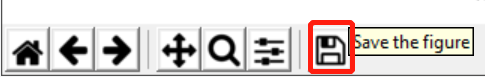
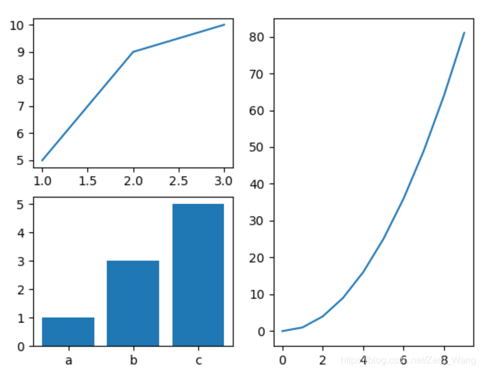
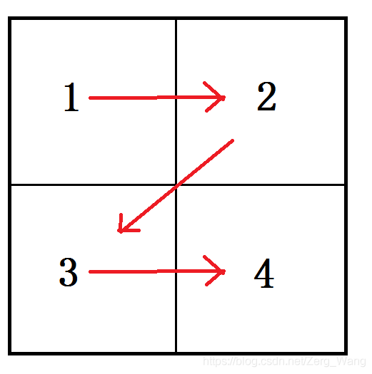
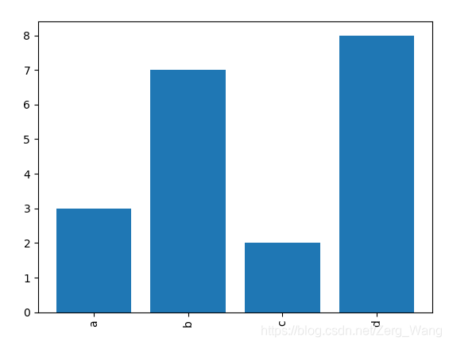
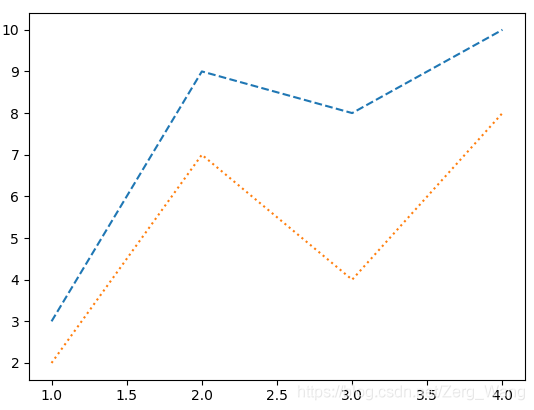
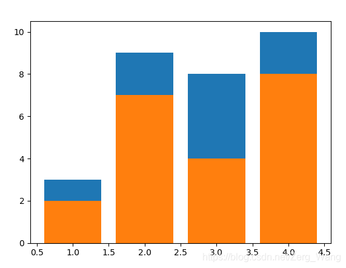
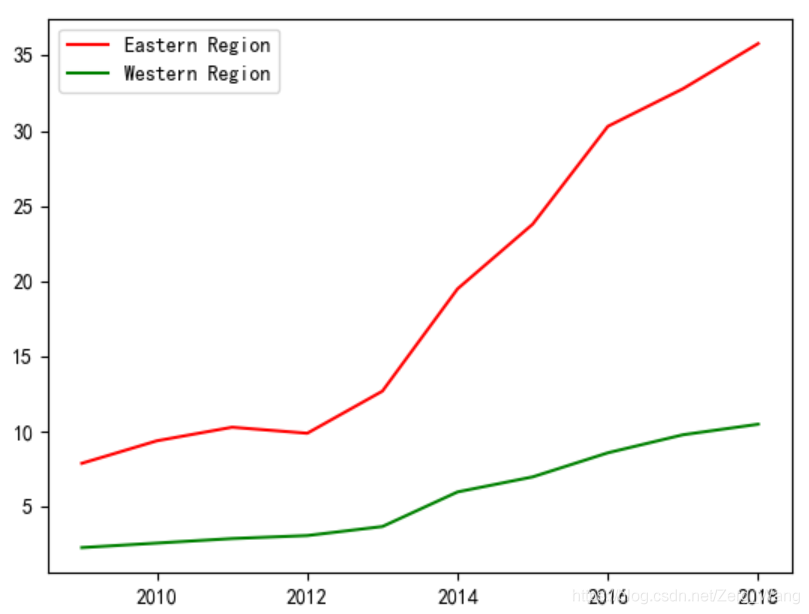
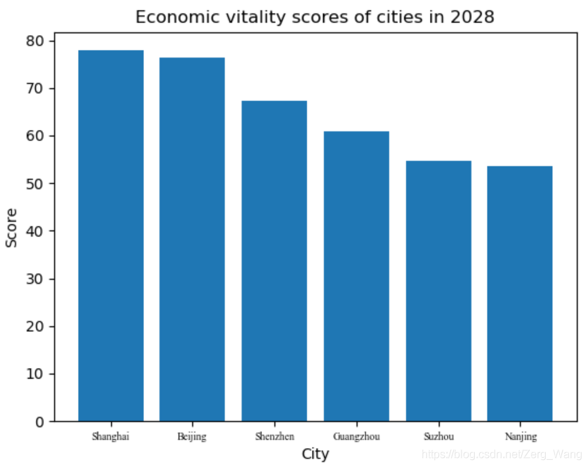

# 前言
一般用到的都是matplotlib中的pyplot库，一般习惯上写为：
```py
import matplotlib.pyplot as plt
```
所以接下来所有的绘图操作基本都会用到plt.打头的函数。
<br/><br/>
 

# 基本操作（散点图、柱状图、折线图）
绘制散点图、柱状图、折线图，分别为：
```py
plt.scatter(x, y)
plt.bar(x, y)
plt.plot(x, y)
```
最基本的两个参数就是x和y，一般都是一维列表，x与y的size要一致，x[i]与y[i]表示图中的一个点的x与y轴坐标。

在绘图后，最后要使用 **plt.show()** 显示出图像。（无论多少张图，一句plt.show()即可。）

生成的图像可以手动调节大小，并保存到本地：


或者使用代码保存，一般写在plt.show()之前。
```py
plt.savefig(path)
```
<br/><br/>

# 设置图像大小及子图
## 图像大小、精细程度、边框等
```py
plt.figure(figsize=(length, width))
```
length和width为两个float类型的变量，代表图像长和宽，默认为6.4和4.8，单位是英寸，但换算到不同的屏幕上……鬼知道是多大，所以参考着默认值来设吧。

此外，plt.figure中还有有参数dpi，可设置图像的精细程度，其值为整型，默认值为100，单位为每英寸长度内的像素点数。在plt.savefig中也可调用该参数，从而对图像以指定精细度保存。

设置边框的粗细：
```py
import matplotlib as mpl
mpl.rcParams['axes.linewidth'] = 3
```

## 绘制多个子图
假如要绘制如下的三张图：


此时需要用到plt.subplot来编排每个子图的位置（绘制每张子图都要单独调用一次plt.subplot），仅需三个参数：row、column、index，表示将整张画布分成row行、column列，index为要绘图区域的编号，编号的顺序与下图中红色箭头顺序一致。


现在重新聚焦回这三张子图，发现这三张图大致可以分为4块区域，其中，1区为一张折线图，3区为一张柱状图，2区和4区共同构成一张折线图。

因此左上角的图位置应该为plt.subplot(2, 2, 1)；左下角的图位置为plt.subplot(2, 2, 3)。但右侧图不是plt.subplot(2, 2, 3和4)，从整张画布来看，对于右图，其实是plt.subplot(1, 2, 2)，也就是将画布分成左右两部分，右图直接占用了右边一半。具体代码：
```py
import matplotlib.pyplot as plt 
 
plt.subplot(1,2,2)
plt.plot([i for i in range(10)], [j*j for j in range(10)])
 
plt.subplot(2,2,1)
plt.plot([1,2,3], [5,9,10])
 
plt.subplot(2,2,3)
plt.bar(['a', 'b', 'c'], [1,3,5])
 
plt.show()
```
每次使用plt.subplot为子图指派位置后，后面就应该接上绘制该子图的代码。

另外，plt.subplot的参数可以简写，plt.subplot(1, 2, 2)可以去掉逗号，直接写成plt.subplot(122)，因此，这也就要求原来的参数应小于10。

如果多张子图之间存在重叠，可以在画图前设置以下参数来避免：
```py
plt.rcParams['figure.constrained_layout.use'] = True
```
<br/><br/>

# 坐标轴设置
## 坐标轴刻度与间隔
```py
plt.xticks(list, label, rotation)
plt.yticks(list, label, rotation)
```
list为列表，其中每个元素为实数，表示要显示的刻度在X轴上的位置。例如[0.8, 1, 1.4, 1.8]就表示在X轴上显示4个刻度，分别在x=0.8、1、1.4、1.8的位置显示。label表示对应刻度要显示的内容，如果为空，则为坐标值。rotation表示label显示的内容旋转的角度。
```py
x = [1, 2, 3, 4]
y = [3 ,7 , 2 ,8]
plt.xticks([1, 2, 3, 4], ['a', 'b', 'c', 'd'], rotation=90)
plt.bar(x, y)
```
代码对应的图像为：


实际上list参数可以与x不一致，虽然会比较奇怪……
在没有使用该刻度设置函数的前提下，实际成图的时候会通过x轴表示信息的坐标范围而自动设置刻度。如果不想显示刻度，则list为空即可。
## 坐标轴范围
```py
plt.ylim(ymin, ymax)
```
设置Y轴的表示范围为ymin到ymax。同理可调用plt.xlim。
<br/><br/>

# 设置曲线特征
## 颜色
```py
plt.plot(time, east, color='red', label='Eastern Region')
plt.plot(time, west, color='green', label='Western Region')
```
颜色可以为单个str值，指定该条曲线（散点，柱）的统一的颜色，也可以为与x、y同样size的string类型的列表，为每个值指定颜色（为每个值设置颜色不适用于折线图）。
## 粗细及样式
柱状图中柱子的宽度：
```py
plt.bar(x, y, width=0.5)
```
折线图中曲线粗细：（以下两种均可调用）
```py
plt.plot(x, y, linewidth=0.5)
plt.plot(x, y, lw=0.5)
```
折线图中曲线样式：（以下两种均可调用）
```py
plt.plot(x, y_high, linestyle='--')
plt.plot(x, y_low, ls='-')
```
'--'表示虚线，'-'表示实线，'-.'表示点划线，':'表示点线（下图为蓝色为虚线，橙色为点线）

<br/><br/>

# 单图绘制多条曲线
在同一坐标轴下绘制多条曲线，直接调用多个plt.plot()或plt.scatter()等即可。当然，这多个plt.plot()或plt.scatter()等需要使用相同的x轴信息。

若要绘制堆叠柱状图，也可以通过多次调用plt.bar()，但要注意要先调用对应y轴坐标较高的一组，否则y轴坐标较低的一组会被后来画入的y轴坐标较高的一组给覆盖掉。
```py
x = [1, 2, 3, 4]
y_low = [2, 7, 4, 8]
y_high = [3, 9, 8, 10]
plt.bar(x, y_high)
plt.bar(x, y_low)
plt.show()
```

## 曲线标签设置
为了使多条曲线间具有区分度，可设置曲线的标签和颜色，若要在图中显示图例（说明什么颜色的曲线表示什么），则label必须要设置，并在绘图函数后加以下语句以显示不同曲线的标签信息
```py
plt.legend(loc='upper left')
```
如图，标签信息显示在左上角，实际上标签信息的显示位置是可以指定的：



一般可以写loc='best'，会根据曲线自动调整显示的位置，另外loc可填的有：upper center、upper right、lower left、lower center、lower right、center left、center right、center等。
<br/><br/>

# 为图像添加文字信息
## 设置图表名称
```py
plt.title('Economic vitality scores of cities in 2028')
```
## X、Y轴标签信息
设置x、y轴的信息，从而进行单位说明：
```py
plt.xlabel('City')
plt.ylabel('Score')
```
文字大小、颜色等也可自定义：
```py
plt.ylabel('文字信息', fontsize=文字大小, labelpad=与坐标轴的距离, color=文字颜色)
```



## 曲线上标注具体数值
若要在图中每个点、柱、折线处显示具体数值，可以：
```py
for i, j in zip(x, y):
    plt.text(i, j, j)
```

前面两个参数表示文字显示位置，这个位置为图中柱、点、折线图拐点的x、y坐标，第三个参数表示文字内容。

当然，这些文字的大小、颜色、样式均可在相应函数中进行设置，方法与设置X、Y轴标签信息类似。

## 中文显示
直接输出中文是无法显示的，因为matplotlib默认使用的字体中无中文。因此应更换默认的字体为包括中文的字体样式。

全局更换，也就是把图中所有的字体都换成指定字体（如以下代码指定的SimHei字体，也就是黑体）：
```py
plt.rcParams['font.sans-serif']=['SimHei']
plt.rcParams['axes.unicode_minus'] = False
```
若要局部更换，需要在函数中使用参数指定，如（simsun就是我们常用的宋体）：
```py
from matplotlib import font_manager
plt.ylabel('精度（%）', fontproperties=font_manager.FontProperties(
            fname='C:/Windows/Fonts/simsun.ttc'), fontsize=labelsize, labelpad=5)
```
使用fname指定本地中的字体文件即可，注意此参数应写在字体大小设置等参数的前面，否则会使其他设置无效。
