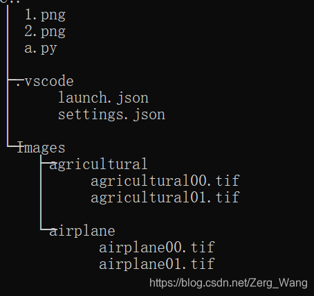
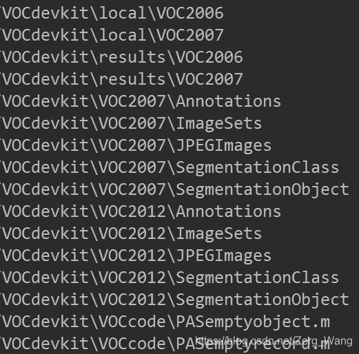

# 路径问题
#### 目录增删
```python
import os, shutil
os.mkdir(path)        #创建单级目录
os.makedirs(path)     #创建多级目录（目标目录及其父目录均未创建时，使用该命令可一同创建，mkdir则不行）
os.rmdir(path)        #删除一个空文件夹（目录），非空会报错
print(os.getcwd())    #打印当前工作所处目录
os.chdir(path)        #更改当前工作所处目录
shutil.rmtree(path)   #删除目录及目录内所有文件
```

#### 相对路径
Python与Linux一致，支持相同路径和绝对路径，且语法一致。

注意：在Windows中，文件的从属关系用“\”表示，然而在Python中该符号为转义符号，因此建议在Python中表示路径时使用“/”或“\\”。（非Windows系统如Linux本身就用“/”表示）。

如果将Python中的某些文件路径打印出来，可能会看到“\\”、“\”和“/”共存的情况，这个不影响，只要代码中使用“/”或“\\”即可。

#### 获取当前文件的位置
```python
import os
print(os.getcwd())
print(os.path.dirname(__file__))    #在Linux中不可用，另外三个均可用
print(os.path.realpath(__file__))
print(os.path.abspath(__file__))
```
在某个Windows的.py文件中（假设为a.py）执行以上代码，输出为：
```bash
C:\Users\Zerg Wang\Desktop
C:/Users/Zerg Wang/Desktop
C:\Users\Zerg Wang\Desktop\a.py
C:\Users\Zerg Wang\Desktop\a.py
```
同样的路径，不同函数混用“\”和“/”。

#### 完整路径下分离路径、文件名、拓展名：
```python
import os 
st = '1/2/3/4/5.jpg' 
print(os.path.split(st))        # ('1/2/3/4', '5.jpg') 
print(os.path.splitext(st))     # ('1/2/3/4/5', '.jpg')
```
os.path.split返回两个值，第一个为字符串st的路径，第二个为文件名。该函数也可对目录使用，假如目录名为4，完整路径为1/2/3/4，则两个返回值分别为1/2/3和4。

os.path.splitext也返回两个值，第一个为文件名（无后缀名），第二个为后缀名（包括“.”）

可用索引指定第一个或第二个值，如：
```python
filename = os.path.splitext(st)[0]
extensionname = os.path.splitext(st)[1]
```

#### 获取文件夹下所有文件名
```python
os.listdir(dir_path)
```
返回一个list，由dir_path下所有文件和文件夹的名字（仅名字，无路径）构成。遍历的深度仅为1，也就是说，如果其内部文件夹中还有文件，这些文件不会被遍历到。

如果要遍历包括所有子文件夹中的内容（深度不限），则使用os.walk(dir_path)，返回三个值：root，dirs，files，其中root为当前遍历的目录地址，dirs为list，存有所有子目录，files也为list，存有所有文件（不包括子目录），若要得到这些值，可以：
```python
for root, dirs, files in os.walk(dir_path):
    print(root)
    for dir in dirs:
        print(dir)    #输出所有子目录名（不含路径）
    for f in files:
        print(f)      #输出所有文件名（不含路径）
```
外层的for循环是控制遍历深度的，也就是说，如果按以上代码运行，第一次循环，遍历深度为1，会输出folder的目录名（root）、folder下的子目录名和folder下的文件名，然后第二次循环，遍历深度为2，会分别输出folder下的子目录名及该子目录下的子目录名和文件，以此类推……举个例子：



假如folder目录下结构如上图所示，则按上述代码，输出为：
```python
C:/Users/Zerg Wang/Desktop/PythonEnv    #遍历深度为1时的root
.vscode
Images                                  #先输出root下仅一层的子目录
1.png
2.png
a.py                                    #再输出root下仅一层的文件
C:/Users/Zerg Wang/Desktop/PythonEnv\.vscode    #遍历深度为2时的root
launch.json
settings.json
C:/Users/Zerg Wang/Desktop/PythonEnv\Images    #遍历深度为2时的root
agricultural
airplane
C:/Users/Zerg Wang/Desktop/PythonEnv\Images\agricultural    #遍历深度为3时的root
agricultural00.tif
agricultural01.tif
C:/Users/Zerg Wang/Desktop/PythonEnv\Images\airplane    #遍历深度为3时的root
airplane00.tif
airplane01.tif
```

#### glob
Python自带的库，无需pip安装，功能类似于Windows中的搜索，其函数glob.glob(path)通过在path中插入通配符“\*”或“?”起到搜索的功能，返回为一个列表，包含所有符合的结果路径。除了常用的glob.glob，还有glob.iglob，两者功能类似，后者返回迭代器。

以VOC数据集的路径为例：
```python
import glob 
for path in glob.glob('VOCdevkit/*/*'):
    print(path)
```
输出内容的部分截图：



再介绍一下通配符，“\*”用于匹配0到多个字符，例如*.jpg就是所有扩展名为jpg的文件，而“?”仅匹配一个字符，例如“VOC20??”输出为“VOC2007”和“VOC2012”，此外在匹配时还可以指定字符，例如[0-9]指定的就是单个数字字符。
<br/><br/>

# 文件读写
正常读取及打印文件内容：
```python
f = open(path,'r')
print(f.read())        #f.readline() or f.readlines()
f.close()              #一般要在最后关闭文件的读写，防止其持续占用计算机资源。
```
'r'表示文件为只读模式。

**f.read()**：一次性读取文件全部内容。

**f.readline()**：每次读取文件中的一行。

**f.readlines()**：同样是读取全部内容，但以list形式返回。

以上方法可接参数，表示每次读取的字节数，因此以上方法可迭代使用。

#### 文件写入
```python
f = open(path,'w')       #若文件不存在会自动创建

f = open(path,'a')       #若文件不存在会自动创建，若文件存在，则在文件末尾追加写入

f.write('context...')    #向文件写入内容

print(something, file=f) #将原本print到控制台或屏幕的内容写入到文件f
```

#### 读写模式
如果要使文件可在程序中既能被读也能被写：模式可以设置为'r+'、'w+'、'a+‘。

文件读写的进度靠一个指针控制，读取和写入共用该指针，也就是说，要实现'a'模式，可以先：
```python
f = open(path,'r+')
f.read()
```
把文件原有内容先读出，指针就会在文件末尾，从而进行内容的追加。

要知道当前指针位置，可用file.tell()，返回一个数字，表示指针前的字节数。

注意：’r+'和'w+'模式是有区别的，'w'和'w+'模式会先将文件原有内容覆盖。


图片出处：http://www.runoob.com/python/python-files-io.html

#### 二进制形式读写：
在对应的模式下加上'b'即可，例如：
```python
f1 = open(path,'rb')
f2 = open(path,'wb')
f3 = open(path,'ab')
```
#### With...as读写方式
为防止文件读写过程中出错中止程序以至于f.close()未能执行，一般会使用try...finally保证文件被正常关闭：
```python
try:
    f = open(path, 'r')
    print(f.read())
finally:
    if f:
        f.close()
```
当然，使用with...as会更加简洁：(虽然没写出来，但无论程序是否中断f.close仍会执行)
```python
with open(path, 'r') as f:
    print(f.read())
```

#### 删除与重命名
```python
import os
os.rename(old_path, new_path)
os.remove(path)
```
#### 复制与移动
```python
import shutil
shutil.move(file_path, target_path)    #文件移动
shutil.copy(file_path, target_path)    #文件复制
```
目标路径target_path最后有没有“/”无所谓。

shutil.copyfile功能与shutil.copy相似，但使用前者可能会遇到权限问题，因此推荐后者。

前面的file_path也可以填写目录名，但shutil.copy复制目录可能会遇到权限问题……

#### 特殊数据类型与文件的交互
字典、列表的内容若要存储于文件，或从文件中读取（代码中的d可以是列表，也可以是字典）：
```python
#保存
f = open('file.txt','w')
f.write(str(d))
f.close()
        
#读取
f = open('file.txt','r')
d = eval(f.read())
f.close()
```
在file.txt中，数据保存的格式与print该列表（或字典）的格式一致。

<br/><br/> 

# Python包引用

同文件夹下的代码文件a要引用代码文件b ：
```python
#This code file is named "a.py"
from . import b
```
导入Python包时的简写
```python
import numpy as np, pandas
```
以上代码的意思不是numpy有两个别名，而是import了numpy和pandas，其中numpy的简写为np，因此也可以写成：
```python
import numpy as np, pandas as pd
```