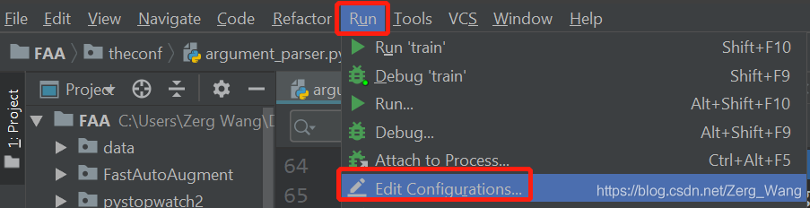
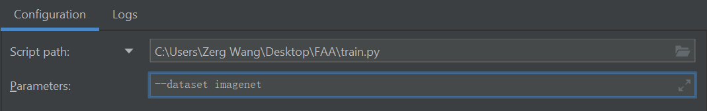
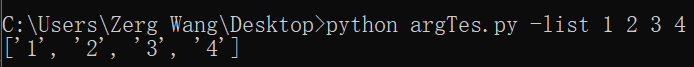
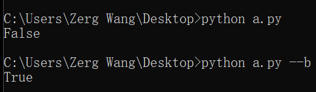

# 列表操作
#### 控制多个循环变量
```python
for i, j in zip(list1, list2):
```
#### 带条件判断的列表生成式
```python
t = [1 if i%2==0 else 0 for i in range(10)]
```
必须带else分支，否则这种情况下的列表项就没值了……就算是赋予空置，也要写个else None上去……
#### 下标
```python
s = 'code'  
print(s[-1])
print(s[-3:-1])
```
对于第二行代码，输出为'e'，即输出倒数第1位，当i>0，s[-i]表示倒数第i位。

对于第三行代码，输出为'od'，即输出倒数第3位到倒数第2位，当a>b>0，s[-a:-b]表示倒数第a位到倒数第b+1位。
<br/><br/>

 

# 日志系统logging
Python自带的日志系统logging可以简单理解为一种高级的print函数，可以将需要的信息显示到控制台或者输出到文件中。
#### 日志级别
通过logging输出的信息分为五个级别，按顺序重要程度递增：（以下是输出该五种信息的方式）
```python
import logging
logging.debug('debug message')
logging.info('info message')
logging.warning('warning message')
logging.error('error message')
logging.critical('critical message')
```
logging默认只输出warning及以上等级的信息到控制台，可进行设置：（全场仅需设置一次）
```python
logging.basicConfig(level=logging.DEBUG)
或
logging.basicConfig(level=logging.NOTSET)
```
如此设置可输出debug及以上级别的信息到控制台。

#### 输出到控制台
如上，basicConfig可设置被输出到控制台的信息等级以及信息的格式：
```python
logging.basicConfig(level=logging.DEBUG,
                    format='%(asctime)s - %(filename)s[line:%(lineno)d] - %(levelname)s: %(message)s')
```
每次调用logging.info、logging.warning等五个函数输出信息时，就会以上规定的格式输出，信息本身在格式控制中以%(message)代替。

#### 输出到文件
信息输出函数不变，但在输出前需要设置：
```python
logger = logging.getLogger()
logger.setLevel(logging.INFO)  # Log等级总开关
fh = logging.FileHandler(file_path, mode='w') #file_path为文件地址
fh.setLevel(logging.DEBUG)  # 输出到file的log等级的开关
fh.setFormatter(logging.Formatter("%(message)s")) #定义handler的输出格式，这里略去了时间等信息的输出，仅保留日志信息本身
logger.addHandler(fh)
```
#### 同时输出到控制台和文件
相比“输出到文件”的代码，多加一个用于控制台的handle即可：
```python
ch = logging.StreamHandler()
ch.setLevel(logging.WARNING)  # 输出到console的log等级的开关
ch.setFormatter(logging.Formatter("%(message)s"))
logger.addHandler(ch)
```
<br/><br/>


# PyCharm调试

在相应的行号后面单击即可设置断点。
**Step Into（F7）**：执行下一步，遇到函数会单步进入。
**Step Over（F8）**：执行下一步，遇到函数会将其整个执行完，不会单步进入。
**Step Out（Shift+F8）**：若执行位置所处函数内无断点，会执行完函数剩余部分并跳出函数，若有则跳到断点。

#### 含参数调试
若要调试通过控制台传入参数的程序，则：



选择相应程序，在Configuration下的Parameters填入相关参数即可，例如：



<br/><br/>

# 命令行参数
```python
import argparse
parser = argparse.ArgumentParser()
parser.add_argument('-n')
args = parser.parse_args()
```
以上为格式，除了第三行其他照抄就行，第三行表示使用命令行调用该程序时可添加一个参数“-n”。每个parser.add_argument语句定义一个命令行参数，接下来详解该语句：

#### 参数的基本定义
```python
parser.add_argument('name')
parser.add_argument('-name')
parser.add_argument('--name')
parser.add_argument('-n', '--name')
```
第一行，添加一个命令行参数name，这个参数没有像前面以“-”或“--”开头，则说明这个参数在命令行中是必须输入的。在命令行中要输入该参数时直接输即可，前面无需使用“-name”或“--name”声明。但如果有多个这样的参数需要传入，要按代码中定义的前后顺序传入。

第二行和第三行的以“-”或“--”开头，说明这些参数在命令行中可输也可不输，如果要输，则通过参数名指定（前面的“-”或“--”不能省）。如果有多个需要指定的变量，前后顺序无所谓。

第四行原参数为“--name”，但同时也为其定义了一个简版。简版以“-”开头，放前面，完整的以“--”开头，放后面。在命令行中通过“-n”和“--name”都可以传值，

在Python代码中可通过args.参数名来调用这些值。例如上面的四个例子，无论是“-name”、“--name”还是“-n”，都通过args.name访问，数据类型默认都为string。

除了以上的基本定义，parser.add_argument还可通过一些属性实现更多功能：

#### help
调用了argparse，命令行调用的时候会自带一个-h（完整：--help），功能类似于cmd中的help命令，显示所有自定义参数的描述，这个描述可通过help属性自定义：
```python
parser.add_argument('-n', '--name', help='Tell us your name')
```

#### type及default
type指定传入值的数据类型，默认为string。default为未通过命令行赋值的变量赋以默认值。
```python
parser.add_argument('-number', default=200, type=int)
```
对于那些又无默认值，又未通过命令行赋值的变量，其值一般为None。

#### choices
为传入的值进行规范，传入的值必须为choices列表规定的合法值，否则会报错。
```python
parser.add_argument('-number', choices=[1,2,3], type=int)
```
#### required
当required=True时，说明定义的变量必须要通过命令行传值。（而且也要通过“-number”指定）
```python
parser.add_argument('-number', required=True, type=int)
```
#### nargs
如果列表要通过命令行传值，可通过nargs指定一次传入值的个数，如果个数不确定，可以写为：
```python
parser.add_argument('-list', nargs='+')
```
传入值至少为一个。如果nargs='*'，表示传入值至少0个，若nargs='?'，则传入值为0或1个。

#### action
action有两个值：store_true和store_false，该参数起到的是“开关”的作用，不调用该参数则为默认值，一旦有“调用”这个动作，值就变动为action中指定的值。
```python
parser.add_argument('--b', action='store_true', default=False)
```
输出b，可以看到：


#### parse_known_args
该方法是ArgumentParser类实例化后的对象的方法，可用于多次传参。假如现在我要获取男生的身高和女生的体重，在输入的时候，第一项是性别，第二项则取决于第一项的输入，则：
```python
import argparse
parser = argparse.ArgumentParser()
parser.add_argument('-g','--gender')
exist_parameters, unparsed = parser.parse_known_args()
if exist_parameters.__getattribute__('gender') == 'male':
    parser.add_argument('-t', '--tall')
else:
    parser.add_argument('-w', '--weight')
args = parser.parse_args()
```
输入：python a.py -g male -t 173

通过parse_known_args，已经指明的gender和对应值“male”被存入了exist_parameters，而因为-t还未被指派，暂时存入unparsed（以列表形式：['-t', '173']）

对于exist_parameters，使用__getattribute__获取到其内部已指派好的参数值，即可知晓下一步引入何种参数。

如果在unparsed中的值直到最后（指定义args变量这一步）也没有通过add_argument进行指派，则会报错。

 <br/><br/>


# 其他
#### 查看对象所占用的内存空间
```python
import sys
k = [1, 2, 3]
print(sys.getsizeof(k))
```
以上代码输出88，表示k占用88个字节。

有意思的地方在于：
```python
import sys
list1 = range(1000)
list2 = [i for i in range(1000)]
print(sys.getsizeof(list1))    #48
print(sys.getsizeof(list2))    #9024
```
用range函数返回类似list的类，相比于直接生成一个列表，会节省非常多空间。

#### 布尔值的一些冷知识
以下值会被python认为是False：
```python
None    0    ""    ''    ()    []    {}
```
编译器会隐式转换这些值。虽然都认作False，但它们之间是不相等的，甚至直接与False相比，它们也是不相等的：
```python
print([]==())
print([]==False)
```
输出都为False。
#### 下载
例如，从网络上下载一张图片：
```python
import urllib.request
url = 'http://www.ZergWang.com/789.png'
urllib.request.urlretrieve(url, 'zergwang.png')
```
#### 将多张图片拼接成PDF
使用fpdf库：
```python
from fpdf import FPDF
from PIL import Image
 
pages = 10
img = Image.open('0.png')
width, height = img.size[0], img.size[1]
newPDF = FPDF(unit = "pt", format = [width, height])
for i in range(pages):
    newPDF.add_page()
    newPDF.image('%s.png'%i, 0, 0)
newPDF.output('example.pdf', 'F')
```
#### 一行写不下时
```python
a = [1] + \
    [2]
```
<br/><br/>

# 参考资料
[python中logging模块的一些简单用法](https://www.cnblogs.com/CJOKER/p/8295272.html)
