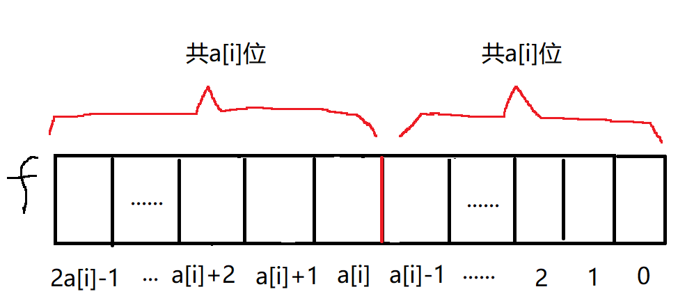

# 异或使用技巧

## [LeetCode 136](https://leetcode.com/problems/single-number/)


数组中有n个元素。其中一个特殊元素仅在数组中出现一次，其他每个元素会在数组中出现两次。在$O(N)$时间找出这个特殊的元素。

利用异或运算的特性（a\^b\^b=a），令0与数组中每个元素相异或，最终结果即为特殊元素。

```cpp
int singleNumber(int* a, int n){
    int ans = 0;
    for (int i=0; i<n; i++) 
        ans ^= a[i];
    return ans;
}
```

## [LeetCode 137](https://leetcode.com/problems/single-number-ii/solutions/)

数组中有n个元素。其中一个特殊元素仅在数组中出现一次，其他每个元素会在数组中出现三次。在$O(N)$时间找出这个特殊的元素。


首先可以累计数组所有元素在每个bit位“1”的数量（假设该结果为sum），sum mod 3后即可得到特殊元素。

值得注意的是，除了特殊元素，数组中其他所有元素的在各个bit位“1”的数量之和，必定都是3的倍数，因此我们可以统计数组所有元素在每个bit位“1”的数量之和。假设$s_i$为数组所有元素在第$i$位的“1”数量之和，$s_i \mod 3$即为特殊元素第$i$位的值。

```cpp
class Solution {
public:
    int singleNumber(vector<int>& a) {
        int ans = 0;
        for (int i=0; i<32; ++i) {  
        // 统计数组所有元素在第i位上“1”的数量
            int cnt = 0;
            for (int j: a) 
                cnt += j >> i & 1;
            if (cnt % 3)
                ans |= 1 << i; 
        }
        return ans;
    }
};
```


异或操作本质上来说，是一种不进位的加法运算，或者说是一种“模2加法”运算。a\^b等价于a和b逐位相加再mod 2。例如 1100 ^ 1001，首先逐位相加得到 2101，然后逐位mod 2，得到 0101。

那么在这道题中，可以将异或运算改造成“模3加法”，这样就能使用与[LeetCode 136](https://leetcode.com/problems/single-number/)相同的思路去找特殊元素。

具体改造可参考以下教程： [带你一步步推导出位运算公式！](https://leetcode.cn/problems/single-number-ii/solutions/2482832/dai-ni-yi-bu-bu-tui-dao-chu-wei-yun-suan-wnwy/)

<br/><br/>

# 力扣周赛400第4题：[LeetCode 3171](https://leetcode.com/problems/find-subarray-with-bitwise-or-closest-to-k/)

给出一个int型数组a和正整数k，从a中找出一个子数组，子数组中所有元素或运算的结果与k的差值最小，输出最小的差值。

最简单的想法是暴力枚举出所有的子数组，算出每个子数组或运算的结果，然后与k的差值比较即可。首先我们声明一个全为0的数组b，然后枚举每个```a[i]```，然后令```a[i]```分别与```b[0]```到```b[i]```执行或运算，结果存储到对应b数组中。这样一来，每枚举一个```a[i]```，都能得到```a[0]```到```a[i]```组成的所有子数组。

| 枚举 | b[0]存储的值 | b[1]存储的值 | b[2]存储的值|
| --   | --          | --          | --          |
| i = 0| a[0]        | 0        | 0       |
| i = 1| a[0] \| a[1] | a[1]        |  0     |
| i = 2| a[0] \| a[1] \| a[2]| a[1] \| a[2]| a[2]|
| ... |

然而，上述枚举仍是$O(N^2)$的时间复杂度，仍会超时。实际上，利用位运算的性质可以优化到$O(N\log N)$。

首先明确一个知识点：当一个数逐步与其他多个数作或运算，结果要么不变，要么越来越大。这是因为或运算可以看作是求两个集合（在这里指数字）的并集，因此无论与什么数作或运算，结果必然不会变小。同理，与运算可以看作是求两个集合的交集，因此当一个数逐步与其他多个数作与运算，结果要么不变，要么越来越小。

利用上述性质，假设当```b[j] |= a[i]``` ( 0 < j < i)后```b[j]```值不变，这说明在执行或运算前，```a[i]```是```b[j]```的子集（即$ a[i] \subseteq b[j]$），那么此时对b的循环就可以break了，因为```a[i]```与```b[j]```执行或运算前，```b[j-1]```等于```a[j-1] | b[j]```，```b[j]```必为```b[j-1]```的子集（即 $b[j] \subseteq b[j-1]$）。因此```a[i]```必定为```b[j-1]```的子集，他们或运算后```b[j-1]```结果必定不变。同理，```a[i]```与b数组前面的元素或运算的结果也不变，因此可以直接break。

实际代码中，我们可以直接在数组a上运算，不必额外开一个b数组。
```cpp
class Solution {
public:
    int minimumDifference(vector<int>& a, int k) {
        int ans = INT_MAX;
        for (int i=0; i<a.size(); ++i) {
            ans = min(ans, abs(a[i]-k));
            for (int j=i-1; j>=0; --j) 
                if ((a[j] | a[i]) == a[j])
                    break;
                else {
                    a[j] |= a[i];
                    ans = min(ans, abs(a[j]-k));
                }
        }
        return ans; 
    }
};
```

以上性质同样适用于与运算。[LeetCode 1521](https://leetcode.com/problems/find-a-value-of-a-mysterious-function-closest-to-target/)把或运算改成与运算。其他地方和周赛这题一样，直接将周赛的代码中的或运算改成与运算就能过这道题。

<br/><br/>

# 力扣双周赛134第4题：[LeetCode 3209](https://leetcode.com/problems/number-of-subarrays-with-and-value-of-k/)

给出一个非负整数数组和非负整数k，求出以下这种子数组的数量：子数组各项按位与运算结果等于k。

这道题与周赛400的第四题很相似，实际上可以直接使用周赛400的思路，遍历数组a，令```b[j]```等于```a[j] & a[j+1] & ... & a[i]```，这样就能枚举出所有的子数组。参与与运算的元素越多，结果就越小（严谨地说，是结果永远不会变大）。如此操作得到的b数组是单调递增的，因此可以直接在b中二分查找等于k的元素的左边界和右边界，右边界减去左边界即可得到b中等于k的元素的数量。

```cpp
class Solution {
public:
    long long countSubarrays(vector<int>& a, int k) {
        long long ans = 0;        
        for (int i=0; i<a.size(); ++i) {
            for (int j=i-1; j>=0; --j) 
                if ((a[j] & a[i]) == a[j])
                    break;
                else 
                    a[j] &= a[i];
            auto lef = lower_bound(a.begin(), a.begin()+i+1, k);
            auto rig = upper_bound(a.begin(), a.begin()+i+1, k);
            ans += rig - lef;
        }
        return ans; 
    }
};
```

除了二分查找，此题也可以继续使用位运算与集合的思想优化。首先在运算过程中必定有以下性质：$b[0] \subseteq b[1] \subseteq ... b[j] ... \subseteq b[i]$。

根据这个性质，我们可以得到如下推论：

1. 当```b[j]```与```a[i]```AND后的结果是k的真子集，则之后```b[0] ... b[j-1]```与```a[i]```AND的结果必定都是k的真子集，之后直到程序结束，都无需更新```b[0] ... b[j]```的值了。因此我们可以使用一个变量```st```作为标记，b中索引值比st小的元素都无需更新。则我们有：$k \subseteq b[st] \subseteq b[st+1] \subseteq ... b[j] ... \subseteq b[i]$。

2. 当```b[j]```与```a[i]```AND后的结果等于k，则```b[st] ... b[j-1]```与```a[i]```AND后的结果都为k，此时答案数直接加上```j-st+1```即可。

3. 当```b[j]```与```a[i]```AND后的结果不变，则说明$b[j] \subseteq a[i]$，则```b[st] ... b[j]```分别与```a[i]```AND后值都不变。而且它们AND的结果必定时k的超集。因此我们可以用一个变量```lastAns```记录上一轮对```i```遍历时新增的答案数，当遇到这种情况时直接令总答案数加上```lastAns```即可。


```cpp
class Solution {
public:
    long long countSubarrays(vector<int>& a, int k) {
        int n = a.size();
        long long ans = 0;
        int st = 0;
        long long lastAns = 0;

        for (int i=0; i<n; ++i) {
            for (int j=i; j>=st; --j) {
                if ((a[j] & a[i] & k) < k) {//利用推论1
                    st = j+1;
                    lastAns = 0;
                    break;
                }
                
                if (j!=i && (a[j] & a[i]) == a[j]) {// 利用推论3
                    ans += lastAns;
                    break;
                }

                a[j] &= a[i];
                if (a[j] == k) {   // 利用推论2
                    lastAns = j-st + 1;
                    ans += lastAns;
                    break;
                }    
            }      
        }

        return ans;
    }
};
```

<br/><br/>

# 力扣周赛401第4题：[LeetCode 3181](https://leetcode.com/problems/maximum-total-reward-using-operations-ii/)

给出一个int型数组a，可逐步取该数组中的元素，数组中每个元素最多取一次。如果取了某个元素，则当前的得分会加上该元素的值。但是在取元素时，待取元素的值必须大于当前得分才能取。问能得到的最高得分是多少。

变种版本的01背包问题。为了达到最高得分，取的时候必须要先取小元素，再去大元素。因此先对a数组从小到大排序。然后用01背包的思想去做即可。

```cpp
class Solution {
public:
    int maxTotalReward(vector<int>& a) {
        sort(a.begin(), a.end());
        bool f[100005];    // f[j]为1表示最终得分可以达到j
        memset(f, 0, sizeof(f));

        f[0] = 1;
        for (int i=0; i<a.size(); ++i)
            for (int j=2*a[i]-1; j>= a[i]; --j)
    //取了第i个元素后得分达到j，那么在取之前的得分必须小于a[i]才行，即j-a[i] < a[i]，也就是说j不能大于2*a[i]。此为循环的边界条件
                f[j] = max(f[j], f[j-a[i]]);
        
        for (int i=100000; i>=0; --i)
            if (f[i])
                return i;
                
        return 0;
    }
};
```

上述代码可以过周赛的第3题，但第4题的$n=50000$，必须要进一步的优化。

首先可以使用bitset来替代布尔数组，从而节省空间，并使用位运算进行状态转移。这样一来可勉强将时间复杂度压缩到$10^8$内。

首先，```f[j] = max(f[j], f[j-a[i]])```可优化为```f[j] |= f[j-a[i]]```。其次，内层j的循环可以看作是如下图所示的，左边的一共a[i]位与右边的a[i]位一一进行或运算，结果赋值到左边对应位置。


使用位运算则可免除内层j的循环。我们可以生成一个新的bitset变量k，其中k的```a[i]```位到```2a[i]-1```位是变量f的0到```a[i]-1```位的值，k的其他部分均为0，然后我们令```f |= k```即可完成状态转移。

假设f的长度为m，则首先令k等于f左移m-a[i]位，此时k的最左边的a[i]位的值等于原来f的0到```a[i]-1```位，k剩下的所有位都为0。然后再让k右移m-2a[i]位，则k的```a[i]```位到```2a[i]-1```位是变量f的0到```a[i]-1```位的值，其他位都为0。

```cpp
class Solution {
public:
    int maxTotalReward(vector<int>& a) {
        sort(a.begin(), a.end());
        bitset<100005> f;
        f[0] = 1;
        for (int i=0; i<a.size(); ++i) 
            f |= f << (f.size() - a[i]) >> (f.size() - a[i]- a[i]);

        for (int i=100000; i>=0; --i)
            if (f[i])
                return i;         
        return 0;
    }
};
```