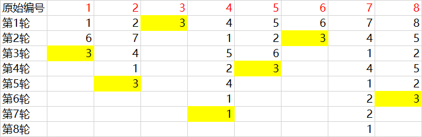

# [LeetCode 1630](https://leetcode.com/problems/arithmetic-subarrays/)
若一个数组中的元素按某种顺序排列后能形成等差数列，则该数组是“arithmetic”的。现在给出数组a以及若干个询问，每个询问包含两个数i和j，问a[i]至a[j]这一段子数组是否为“arithmetic”的。

判断数组中元素能否构成等差数列，最简单的想法就是排序，排序后查看相邻两元素的差是否相等。该方法需要的时间复杂度为$O(N \times log N)$。

实际上，可以通过等差数列通项公式将时间复杂度降至$O(N)$。在得知项数（即N）的情况下，找出数组中的最大值max和最小值min，即可计算得到公差$d = \frac{max-min}{N}$。然后，对于数组中的任一元素k，若k能作为等差数列的一部分，则它在等差数列中是第$\frac{k-min}{d}+1$项。因此，我们只需要一个额外的bool数组，来判断等差数列中的每一项是否在数组中均有元素对应即可。

```cpp
bool GetAns(int* a, int lef, int rig) {
    int min = a[lef], max = a[rig];

    for (int i=lef; i<=rig; i++) {
        min = a[i] < min ? a[i] : min;
        max = a[i] > max ? a[i] : max;
    }
    
    if (min==max)
        return 1;
    if ((max-min)%(rig-lef)!=0) 
    //由于数组为int型，若计算得到的公差为小数的话，则绝对不可能构成等差数列
        return 0;

    int d = (max-min)/(rig-lef);
    bool f[505];
    memset(f, 0, sizeof(f));
    for (int i=lef; i<=rig; i++) {
        if ((a[i]-min)%d != 0)
            return 0;
        if (f[(a[i]-min)/d])
            return 0;
        f[(a[i]-min)/d] = 1;
    }
    return 1;
}

bool* checkArithmeticSubarrays(int* a, int n, int* l, int lSize, int* r, int rSize, int* returnSize){
    *returnSize = lSize;
    bool *ans = (bool*)malloc(lSize*sizeof(bool));

    for (int i=0; i<lSize; i++)
        ans[i] = GetAns(a, l[i], r[i]);

    return ans;
}
```
<br/><br/>

# [LeetCode 1823](https://leetcode.com/problems/find-the-winner-of-the-circular-game/)

本题题解参考了以下博文：[约瑟夫环——公式法（递推公式）](https://blog.csdn.net/mzpqq/article/details/124568918)

经典的约瑟夫环问题。n个人围成一个圈报数，从编号为1的人开始报数，报到k的人退出，然后从退出者的下一位开始从1继续报数，重复以上过程直到只剩一人，求此人（即胜利者）坐标。

首先定义函数$f(n,k)$，表示n个人参与游戏，报数的数值为k，最后胜利者的坐标。显然，$f(1, k)$恒等于1。

接下来，我们看如下这张表，假设k=3，第一行是每个人的原始坐标，下面的每行都是每轮报数中每个人报的数（或者说，是每个人在每轮的临时坐标）：



第一轮，每个人报的数（也就是此人在第一轮的临时坐标）都和自己的原始坐标是一致的，第k个人报的数是k，被淘汰了，那么原来的第k+1个人以及其后面的人，在第二轮的临时坐标又从1开始计数，因此在第二轮中每个人的临时坐标都比第一轮少k。同理，第三轮每个人的临时坐标要比第二轮的少k。实际上，由于环的存在，假设某人第i轮的临时坐标为$p_i$，有$p_i = (p_{i+1} + k)\% n_i$，其中$n_i$表示参与第i轮的总人数。

另外，对于$f(n,k)$来说，$f(n, k)$得到的是胜利者在第一轮的临时坐标（其实就是原坐标），$f(n-1, k)$得到的是胜利者在第二轮的临时坐标……$f(n - x, k)$得到的是胜利者在x+1轮的临时坐标$p_{x+1}$。

由此可得$f(n, k) = (f(n-1, k) + k) \% n$。实际上，该公式计算出来可能得到结果为0的情况，这是因为胜利者在第i轮的坐标$p_i = n_i$，此时该坐标对$n_i$取模会得到0，因此：
$$ f(n, k) =\begin{cases}
(f(n-1, k) + k) \% n & (f(n-1, k) + k) \% n>0\\
n & (f(n-1, k) + k) \% n=0
\end{cases}$$

```cpp
int findTheWinner(int n, int k){
    int ans = 1;
    for (int i=2; i<=n; i++) 
        if ((ans + k) % i == 0)
            ans = i;
        else 
            ans = (ans + k) % i;
    return ans;
}
```
<br/><br/>

# [LeetCode 523](https://leetcode.com/problems/continuous-subarray-sum/description/)

给出一个int型数组a和整数k，问数组中是否存在某个子数组，其元素和为k的倍数，如果存在返回True，否则False。


```cpp
class Solution {
public:
    bool checkSubarraySum(vector<int>& a, int k) {
        unordered_map <int, int> b;

        int t = 0;
        for (int i=0; i<a.size(); ++i) {
            t = (t + a[i]) % k;
            bool isContain = b.contains(t);
            if ((i > 0 && t == 0) || (isContain && b[t] < i-1))
                return 1;
            if (!isContain)
                b[t] = i;
        }
        return 0;
    }
};
```


