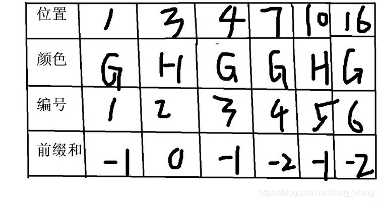
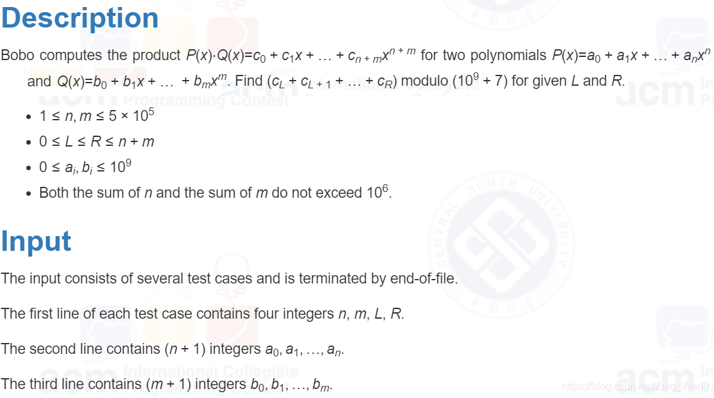
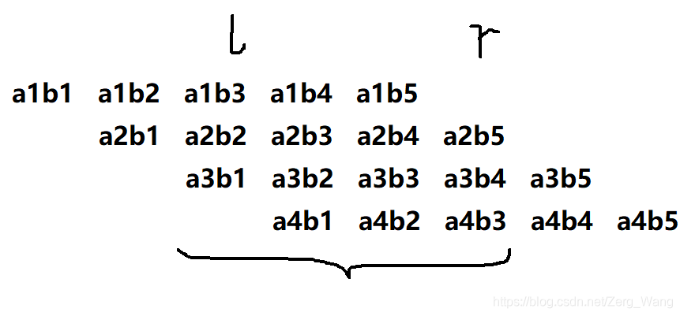

# 例题一
给出n（n<=100000）头牛的坐标与颜色（颜色为G或H），现要从中选出坐标连续的一群牛，要求这群牛要么颜色一致，要么两种颜色的数量相等，问满足上述条件的牛群中，最大坐标差是多少。

首先自然是对输入数据按坐标排序，使得数组下标相邻的牛在位置上也相邻，方便后续处理。

得到颜色一致的连续牛群的最大坐标差不难，但颜色相等应该如何处理呢?这里就用到了前缀和，可以为每种颜色赋一个值，颜色G为-1，颜色H为1，然后累加，令f[k] = a[1] + a[2] + ... + a[k]，即前面k头牛中，颜色H的比颜色G的多f[k]头，如果f[l] 与 f[r] 相等，则表示从第l+1到r的这群牛中两种颜色数量相等。

接下来要找满足条件的l和r，如果枚举l和r来找，时间复杂度为$O(n^2)$，明显超时了。实际上，我们可以新开数组b，用于记录f数组中每个值第一次出现的位置。假设 f[l] 的值为 3484，那我们令b [3484] = l，这样我们如果再次遇到 f[r] = 3484，则可以通过 b[3484]找到l，直接得到区间的 l 和 r 。这样时间复杂度可以降为 $O(n)$。
```cpp
#include <stdio.h>
#include <algorithm>
using namespace std;
 
struct data {int pos, color;};
data a[100005];
int f[100005], n, ans;
int b[200005];
 
bool cmp(data a, data b){
    return a.pos < b.pos;
}
 
int main(){
    scanf("%d", &n);
    for (int i = 1; i <= n; i++){
        scanf("%d", &a[i].pos);
        char ch;
        scanf("%c", &ch);
        a[i].color = (ch == 'G' ? -1 : 1); //初始化
    }
    sort(a+1, a+n+1, cmp);
    for (int i=1; i <= n; i++) 
        f[i] = f[i-1]+a[i].color; //生成前缀和列表
 
    int now=2;              //找颜色一致的牛群
    data k=a[1];
    while (now<=n+1){
        if (a[now].color == k.color) 
            now++; 
        else{
            ans = max(ans, a[now-1].pos - k.pos);
            k = a[now];         
        }
    }
 
    for (int i=1;i<=n;i++){    //找两种颜色数量相同的牛群
        if (b[f[i]+100000]==0) 
            b[f[i]+100000] = i; 
        else
            ans = max(ans,a[i].pos - a[1+b[f[i]+100000]].pos);
        //因为有负数的出现而c++数组坐标是从0开始的，因此每个前缀和列表中的值加上100000
    }
    printf("%d\n", ans);
    return 0;
}
```
<br/><br/>

# 例题二
来自CSU2173：Use FFT，题目描述：

翻译一下，就是给出两个多项式a和b各项的系数，然后令c=a×b，然后给出l和r，问c的从l到r项的系数之和mod 10^9 + 7是多少。

思路：其实看一下下面这图，找下规律：

答案其实就是a1×(b3+b4+b5) + a2×(b2+b3+b4+b5) + a3×(b1+b2+b3+b4) + a4×(b1+b2+b3)，如果对b进行了前缀和处理，括号中的数值仅需O(1)的时间即可求出，然后再分别乘以对应a中的项即可。

代码如下：
```cpp
#include <stdio.h>
#include <cmath>
#include <algorithm>
#include <cstring>
#define MOD 1000000007
using namespace std;
long long a[500005],b[500005],n,m,lef,rig;
int main(){
    while (~scanf("%lld%lld%lld%lld",&n,&m,&lef,&rig)){
        n++;m++;
        memset(a,0,sizeof(a));
        memset(b,0,sizeof(b));
        for (int i=0;i<n;i++) scanf("%lld",&a[i]);
        scanf("%lld",&b[0]);
        for (int i=1;i<m;i++){
            scanf("%lld",&b[i]);
            b[i]+=b[i-1];    //前缀和处理
        }    
        long long hig,low,ans=0;
        for (int i=0;i<=min(rig,n-1);i++){
            if (lef-i>=m) continue;
            if (rig-i>=m) hig=b[m-1]; else hig=b[rig-i];
            if (i>=lef) low=0;else low=b[lef-i-1];
            ans=(ans+(a[i]*((hig-low)%MOD))%MOD)%MOD;
        }
        printf("%lld\n",ans);
    }
    return 0;
}
```

<br/><br/>

# [LeetCode 560](https://leetcode.com/problems/subarray-sum-equals-k/)

给出一个长度为n的数组a和一个数k，求出各项之和等于k的子数组的数量。

暴力解法是枚举子数组的左右两端lef和rig，然后对该子数组(a[lef], a[lef+1], a[lef+2] ... a[rig])求和，看是否等于k。其中可以用到的前缀和优化是另开数组f，令f[i] = a[0] + a[1] + ... + a[i]，则子数组的和等于 f[rig] - f[lef-1]。总体时间复杂度被优化到$O(n^2)$。

实际上，延续上面所述思路，对于某个以a[rig]结尾的子数组，若f[rig] - f[lef-1]等于k，则说明该子数组是我们要寻找的。换句话说，如果数组f中存在某项（该项索引必小于rig），其值等于f[rig] - k，则说明在a[rig]结尾的子数组中，我们找到了一个符合要求的。若f中有 m 项的值都等于 f[rig] - k，则说明在a[rig]结尾的子数组中找到了m个符合要求的。

这样一来，我们将f中各项的值使用一个哈希表b进行存储，b[f[rig] - k] 的值代表f中值等于f[rig] - k的项的数量。之后我们枚举rig，通过累加b[f[rig] - k]，即可求得答案。时间复杂度为$O(n)$

在这种情况下，由于数组f的值都被记录在b中，因此数组f可以被省略掉。

```cpp
class Solution {
public:
    int subarraySum(vector<int>& a, int k) {
        int sum = 0, ans = 0;
        unordered_map <int,int> b;
        b[0] = 1; 
        for(int rig=0; rig<a.size(); rig++) {
            sum += a[rig];   // 累加，此处的sum相当于f[rig]
            if (b.find(sum - k) != b.end())
                ans += b[sum - k]; 
            ++b[sum];
        }
        return ans;
    }
};
```

<br/>

[LeetCode 1074](https://leetcode.com/problems/number-of-submatrices-that-sum-to-target/) 将该问题拓展到二维上，给出一个大小为n*m的二维数组matrix，求出和等于k的子数组。

延续LeetCode 560的思路，我们枚举列的左右两端lefCoulmn和rigColumn。对于matrix中的第i行，从matrix[i][lefColumn]到matrix[i][rigColumn]的连续多个元素之和可以视为LeetCode 560中数组a的第i个元素，然后直接按LeetCode 560处理即可。如此就将二维的问题降为一维。

```cpp
class Solution {
public:
    int numSubmatrixSumTarget(vector<vector<int>>& matrix, int k) {
        int n = matrix.size(), m = matrix[0].size();
        int ans = 0;

        int f[n][m];
        memset(f, 0, sizeof(f));
        f[0][0] = matrix[0][0];   

        for (int i=1; i<n; ++i)
            f[i][0] = f[i-1][0] + matrix[i][0];
        for (int i=1; i<m; ++i)
            f[0][i] = f[0][i-1] + matrix[0][i];
        for (int i=1; i<n; ++i)
            for (int j=1; j<m; ++j) 
                    f[i][j] = f[i][j-1] + f[i-1][j] + matrix[i][j] - f[i-1][j-1];
        // 为了方便matrix[i][lefColumn]到matrix[i][rigColumn]这多个元素的求和，这里使用数组f进行前缀和处理，f[i][j]等于从matrix[0][0]到matrix[i][j]的二维数组的各项之和

        vector<int> a;
        for (int lefColumn = 0; lefColumn < m; ++lefColumn) 
            for (int rigColumn = lefColumn; rigColumn < m; ++rigColumn) {
                a.clear();
                a.push_back(f[0][rigColumn] - (lefColumn == 0 ? 0 : f[0][lefColumn-1]));
                for (int i=1; i<n; ++i) 
                    a.push_back(f[i][rigColumn] - f[i-1][rigColumn] - (lefColumn == 0 ? 0 : f[i][lefColumn-1]) + (lefColumn == 0 ? 0 : f[i-1][lefColumn-1])); 
                ans += subarraySum(a, k);  // 直接调用LeetCode 560的代码即可
            }

        return ans;
    }
};
```

<br/><br/>

# [LeetCode 85](https://leetcode.com/problems/maximal-rectangle/description/)
给出一个仅由0和1构成的二维数组，在数组中寻找全由1构成的最大矩形，输出其面积。数组最大尺寸为200x200。

以下解法时间复杂度为$O(N^3)$
```cpp
class Solution {
public:    
    int maximalRectangle(vector<vector<char>>& a) {
        int ans = 0;
        int n = a.size(), m = a[0].size();
        int sum[n][m];
        memset(sum, 0, sizeof(sum));
        // sum[i][j]等于从a[i][0]到a[i][j]中字符1的个数
        for (int i=0; i<n; ++i) {
            sum[i][0] = a[i][0] == '1' ? 1: 0;
            for (int j=1; j<m; ++j)
                sum[i][j] = sum[i][j-1] + (a[i][j] - '0');
        }            

        for (int i=0; i<n; ++i) {
            int j = 0, start  = -1; 
            while (j < m) {
                if (a[i][j] == '1') {
                    if (start == -1)
                        start = j;
                    // 发现了一条从a[i][start]到a[i][j]的一条由1构成的线段
                    int h = 1; //矩形的长
                    int w = j - start + 1;  // 矩形的宽
                    
                    // 围绕该线段向上以及向下寻找是否有相同位置及长度的线段
                    for (int k=i-1; k>=0; --k)
                        if ((start == 0 && sum[k][j] == w) || (start != 0 && sum[k][j] - sum[k][start-1] == w))
                            ++h;
                        else
                            break;
                    for (int k=i+1; k<n; ++k)
                        if ((start == 0 && sum[k][j] == w) || (start != 0 && sum[k][j] - sum[k][start-1] == w))
                            ++h;
                        else
                            break;
                    ans = max(ans, h*w);
                }
                else 
                    start = -1;
                ++j;
            }
        }
        return ans;
    }
};

```

<br/><br/>

# [LeetCode 3152](https://leetcode.com/problems/special-array-ii/description/)

给出一个长为n数组a，如果数组中任意相邻的两个元素的奇偶性都不同，则该数组为特殊数组。然后给出m次查询，每个查询给出了左右边界，问以该边界的子数组是否特殊。

使用数组b作前缀和，b[i]表示从a[0]到a[i]中共有多少个奇偶性相同的pair，然后对于每个查询，b数组中右边界处值减去左边界处的值，即可得到要查询的区间内奇偶性相同的pair的数量。如果该数量为0，则该子数组为特殊数组。

```cpp
class Solution {
public:
    vector<bool> isArraySpecial(vector<int>& a, vector<vector<int>>& q) {
        vector<int> b {0};       //b[i]：从a[0]到a[i]中共有多少个奇偶性相同的pair
        for (int i=1; i<a.size(); ++i) 
            b.push_back(b.back() + ((a[i] + a[i-1]) % 2 == 0));

        vector <bool> ans;
        for (auto i: q) 
            if (i[1] - i[0] && b[i[1]] - b[i[0]]) 
                ans.push_back(0);
            else 
                ans.push_back(1);

        return ans;
    }
};
```
