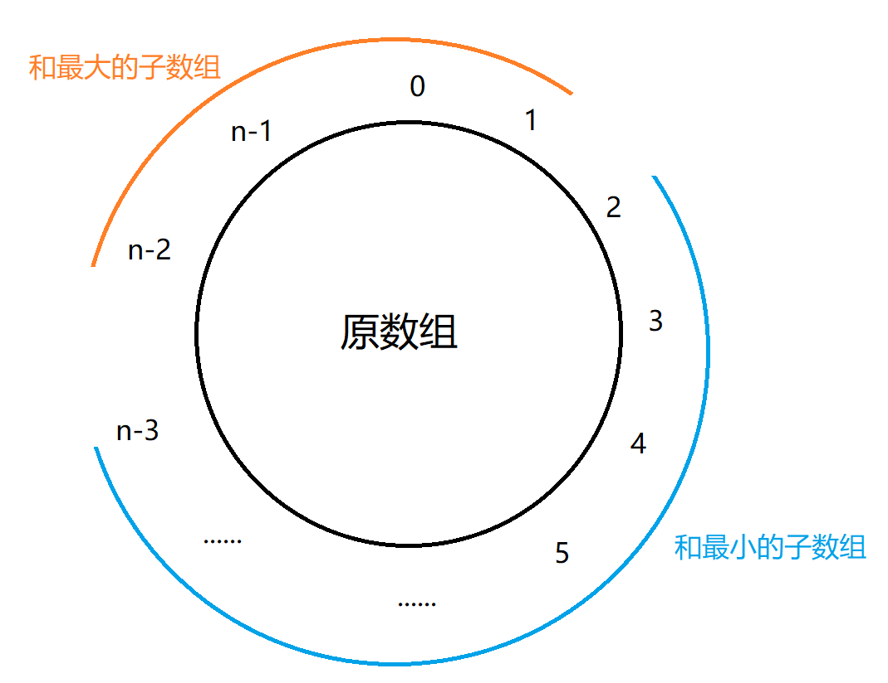

# 最长公共子序列 
题目链接：[LeetCode 1143](https://leetcode.com/problems/longest-common-subsequence/)

给出两个字符串s1和s2，求出这两个字符串最长公共子序列的长度。

新建二维数组f，f[i][j]表示s1前i位构成的子串，和s2前j位构成的子串的最长公共子序列的长度。
$$ f(i, j) =\begin{cases}
1 + f(i-1, j-1)  & s1[i-1] = s2[j-1] \\
max(f(i-1, j), \ \ f(i,j-1))  & s1[i-1] \neq s2[j-1]
\end{cases}$$

```cpp
int Max(int x, int y) {return x > y ? x : y;}
int longestCommonSubsequence(char * s1, char * s2){
    int n1 = strlen(s1), n2 = strlen(s2);
    int f[n1][n2];
    memset(f, 0, sizeof(f));

    f[0][0] = s1[0] == s2[0] ? 1 : 0;
    for (int i=1 ;i<n1; i++)
        if (s2[0] == s1[i])
            f[i][0] = 1;
        else 
            f[i][0] = f[i-1][0];
    
    for (int i=1 ;i<n2; i++)
        if (s1[0] == s2[i])
            f[0][i] = 1;
        else 
            f[0][i] = f[0][i-1];
    
    for (int i=1; i<n1; i++)
        for (int j=1; j<n2; j++) {
            if (s1[i]==s2[j])
                f[i][j] = f[i-1][j-1] + 1;
            else 
                f[i][j] = Max(f[i-1][j], f[i][j-1]);
        }
    
    return f[n1-1][n2-1];
}
```
<br/><br/>

# 字符串转换
题目链接：[LeetCode 72](https://leetcode.com/problems/edit-distance/)

给出两个字符串s1和s2，问最少需要几步能将s1转换成s2。以下三种操作，均算作一步：
- 增：在s1的任意位置加一个字符。
- 删：将s1的任意一个字符删除。
- 改：将s1中的任意一个字符改成另一个字符。

新建二维数组f，f[i][j]表示将s1前i位构成的子串，转换为s2前j位构成的子串，需要的最少步数。举个例子，假设s1为“intention”，s2为“execution”，则f[3][5]表示将“int”转换为“execu”所需的最少步数。

对于将s1前i位转换成s2的前j位，可分别通过以下三种操作实现，其中：
- 增：将s1前i位转换成s2的前j-1位，然后在字符串末尾补上s2的第j位。
- 删：将s1前i-1位转换成s2的前j位，然后再删掉字符串末尾的字符（也就是原来s1的第i位）。
- 改：将将s1前i-1位转换成s2的前j-1位，然后将字符串末尾的字符（即原来s1的第i位）改成s2的第j位。当然，如果s1的第i位等于s2的第j位，则不用改。

由此可得状态转移方程：
$$ f(i, j) =\begin{cases}
min(f(i-1, j)+1, \ \ f(i,j-1)+1, \ \ f(i-1, j-1))  & s1[i-1] = s2[j-1] \\
min(f(i-1, j), \ \ f(i,j-1), \ \ f(i-1, j-1))+1  & s1[i-1] \neq s2[j-1]
\end{cases}$$

```cpp
int minDistance(char * s1, char * s2){
    int n1 = strlen(s1), n2 = strlen(s2);
    if (!n1 || !n2)
        return max(n1, n2);
    
    int f[n1+1][n2+1];
    memset(f, 0, sizeof(f));
    
    for (int i=1; i<=n1; i++)
        f[i][0] = i;

    for (int i=1; i<=n2; i++)
        f[0][i] = i;

    for (int i=1; i<=n1; i++)
        for (int j=1; j<=n2; j++) 
            if (s1[i-1]==s2[j-1])
                f[i][j] = min(f[i-1][j]+1, f[i][j-1]+1, f[i-1][j-1]);
            else 
                f[i][j] = min(f[i-1][j], f[i][j-1], f[i-1][j-1])+1;
    
    
    return f[n1][n2];
}
```
<br/><br/>

# Ugly Number II
题目链接：https://leetcode.com/problems/ugly-number-ii/

给出正整数n，求出自然数中，第n个因数只有2、3、5的数。

所有符合的数都是较小的符合条件的数的倍数，沿着这个思路，新建数组f, f[i]表示第i个符合条件的数，同时新建三个指针，代表“x2”、“x3”、“x5”，这些指针指向数组中的旧元素，分别用于生成旧元素2、3、5倍大小的新元素，假设代表“x2”的指针p2指向的旧元素k，若2k作为新元素进入了数组，则该数组要右移一位，指向下一个旧元素，以此不断生成新元素加入数组f。
```cpp
int nthUglyNumber(int n){
    int p2 = 0, p3 = 0, p5 = 0;
    int f[n];
    f[0] = 1;

    for (int i=1; i<n; i++) {
        f[i] = Min(Min(f[p2]*2, f[p3]*3), f[p5]*5);
        if (f[i]==f[p2]*2)
            p2++;
        if (f[i]==f[p3]*3)
            p3++;
        if (f[i]==f[p5]*5)
            p5++;

    }
    return f[n-1];
}
```
注意：在判断数组中新元素是否为某个旧元素的倍数时不能写else if，这是因为多个指针可能指向同一个旧元素，若该旧元素的倍数作为新元素进入数组，则所有指向该旧元素的指针都要移动，否则数组中会产生重复的值。
<br/><br/>

# Kadane’s Algorithm
题目链接：[LeetCode 53](https://leetcode.com/problems/maximum-subarray/)

该算法用于在数组中寻找各元素之和最大的子数组。

假设原数组为a。新建数组f, f[i]表示以第i个元素结尾的子数组中，元素之和的最大值。显然，f[i]的值受到f[i-1]的影响，如果以第i-1个元素结尾的子数组之和，加上第i个元素后，还没有第i个元素大，那么显然第i个元素“自立门户”更好，否则就直接继承前面的子数组即可，状态转移方程为：
$ f(i) = Max(f(i-1) + a_i, \ \ \ a_i)$

由于f中的每个元素仅会决定其下一个元素的值，之后该元素就不会再使用了，因此在实际应用中不必使用数组，单个变量即可实现f的功能。

```cpp
int maxSubArray(int* a, int n){
    int lastMax = a[0], ans = a[0];
    for (int i=1; i<n; i++) {
        lastMax = Max(lastMax + a[i], a[i]);;
        ans = Max(ans, lastMax);
    }    
    return ans;    
}
```

在环状数组中寻找最大的子数组：[LeetCode 918](https://leetcode.com/problems/maximum-sum-circular-subarray/)

由于环状数组中的元素编号仍是0至n-1，因此子数组中元素索引可能是不连续的。对此，我们可以把这个问题分解成两个子问题：（1）找索引连续的最大子数组；（2）找索引不连续的最大子数组。

对于子问题1，做法和上述LeetCode 53一样，直接使用Kadane’s Algorithm即可。对于子问题2，使用逆向思维。元素和最大子数组，实际上等于整个数组的和，减去元素和最小的子数组。如果元素和最大的子数组中元素索引不连续，则元素和最小的子数组索引必定是连续的。因此，同样直接使用Kadane’s Algorithm，寻找元素和最小的子数组即可。


```cpp
int maxSubarraySumCircular(int* a, int n){
    int lastMax, lastMin, maxSum, sum, minSum;

    lastMax = lastMin =  maxSum = minSum = sum = a[0];
    for (int i=1; i<n; i++) {
        sum += a[i];
        lastMax = Max(lastMax + a[i], a[i]);
        lastMin = Min(lastMin + a[i], a[i]);
        maxSum = Max(maxSum, lastMax);  //最大子数组的和
        minSum = Min(minSum, lastMin);  //最小子数组的和
    }   

    //题目规定最大子数组至少要有一个元素，也就是说我们得到的最小子数组的元素数量应小于整个数组，否则最大子数组就为空了
    //当最小子数组的元素数量等于整个数组时，意味着最小子数组的和等于整个数组
    if (minSum == sum) 
        return maxSum;
    return Max(maxSum, sum - minSum);  
}
```
<br/><br/>


# 内外层循环对排列组合的影响


[LeetCode 518](https://leetcode.com/problems/coin-change-ii/) ：给出一个数组和一个目标值，从数组中取出若干元素形成排列（数组中的每个数均可无限使用），排列中的所有元素和等于目标值。输出满足条件的不同排列的数量。


[LeetCode 377](https://leetcode.com/problems/combination-sum-iv/)：给出一个数组和一个目标值，从数组中取出若干元素形成组合（数组中的每个数均可无限使用），组合中的所有元素和等于目标值。输出满足条件的不同组合的数量。


这两题都是给出一个数组和一个目标值，使用数组中的元素（每个元素的数量无限）来组成目标值，问共有多少种方案。两题的区别在于前者从数组中挑出若干数形成排列，需考虑组成目标值的元素顺序。假设数组为[1, 2, 3]，目标值为4：

[LeetCode 518](https://leetcode.com/problems/coin-change-ii/)的方案数为7:
-  1 + 1 + 1 + 1
-  1 + 1 + 2
-  1 + 2 + 1
-  1 + 3
-  2 + 1 + 1
-  2 + 2
-  3 + 1
  
[LeetCode 377](https://leetcode.com/problems/combination-sum-iv/)的方案数为4：
- 1 + 1 + 1 + 1
- 1 + 1 + 2
- 2 + 2
- 3 + 1


我看不懂，但我大受震撼

