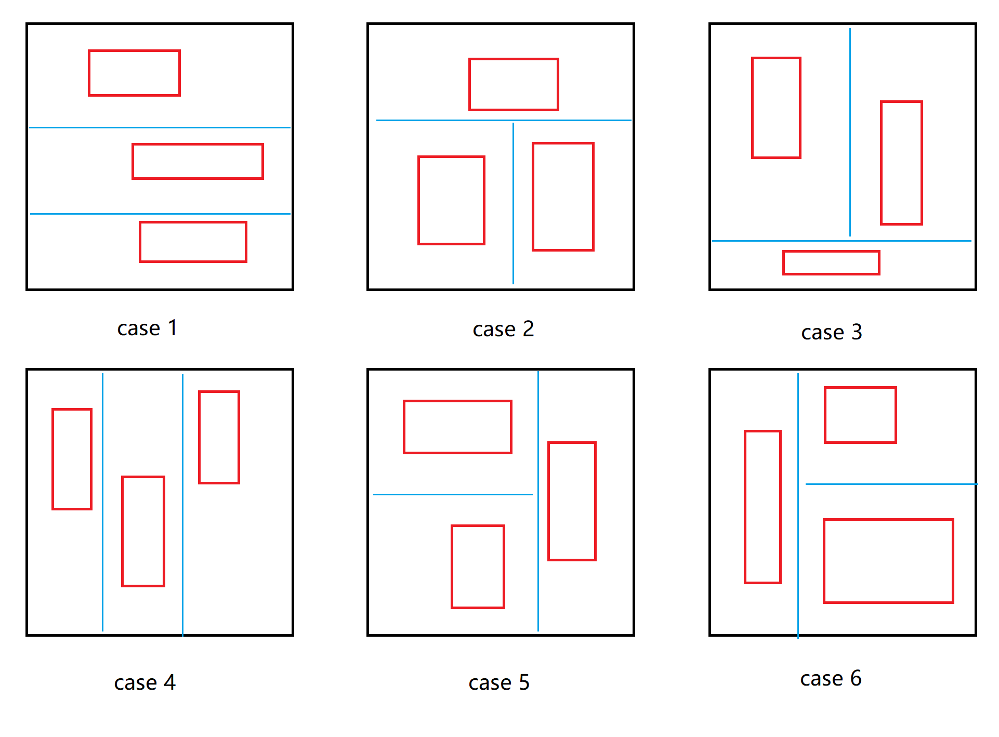

还没写但计划要写的题解也放在这里

# [LeetCode 41](https://leetcode.com/problems/first-missing-positive/description/)

给一个长度为n的未经排序的数组，用$O(N)$时间找出该数组缺失的最小正整数。

解法：对于数组中的每个正整数，将该数换到其值对应的数组下标处。经过该处理后，数组中所有正整数都被放置在其对应的下标处。然后从数组下标1开始逐一检查每个位置的数是否与其位置信息相一致。首个不一致处的坐标值即为缺失的最小正整数。

如果在经过交换后数组中每个位置的数是否与其位置信息一致，则说明该数组包含了1到n的所有数，此时答案为n+1。

```cpp
class Solution {
public:
    int firstMissingPositive(vector<int>& a) {
        int n = a.size();
        for (int i=0; i<n; ++i)
            while (a[i] > 0 && a[i] <= n && a[i] != i+1 && a[a[i]-1] != a[i])
                swap(a[i], a[a[i]-1]);
        // 为防止交换时未经处理的正整数被换到数组前部从而无法被for循环覆盖，添加while循环，令被交换的数提前被处理到合适位置   
        for (int i=0; i<n; ++i)
            if (a[i] != i+1)
                return i+1;
        return n+1;
    }
};

```

<br/><br/>

# 力扣双周赛403第4题：[LeetCode 3197](https://leetcode.com/problems/find-the-minimum-area-to-cover-all-ones-ii/)

给出一个仅由0和1构成的二维数组，现在需要三个矩形去覆盖其中所所有的1。这三个矩形面积至少为1，且互不重叠。问符合要求的三个矩形面积最小为多少。

本题解思路参考资料：[六种情况，从 O((mn)^2) 到 O(mn)](https://leetcode.cn/problems/find-the-minimum-area-to-cover-all-ones-ii/solutions/2819357/mei-ju-pythonjavacgo-by-endlesscheng-uu5p/)

周赛第2题与此题类似，但是仅使用一个矩形去覆盖所有的1。可以考虑将第4题拆分成多个由多个第2题的问题。

首先考虑这三个矩形的位置关系，不难发现有如下6种情况：



因此，我们首先分6种情况，对于每种情况来枚举对应的蓝色分割线，将二维数组分成三个区域，对于每个区域直接复用第2题的代码即可求解。

进一步的优化：不难发现，case 4、5、6分别是case 1、2、3旋转90度后的情况，因此我们实际编码时只需要完成case 1、2、3的编码即可。在解决完case 1、2、3后将二维数组旋转，再执行case 1、2、3的代码。（实际写起来一个case的代码挺短，不旋转也行）


```cpp
class Solution {
public:
    int F(vector<vector<int>>& a, int ttop, int bbot, int llef, int rrig) {
        int top = 9999, bot = -1, lef = 9999, rig = -1;

        for (int i=ttop; i<=bbot; ++i)
            for (int j=llef; j<=rrig; ++j)
                if (a[i][j]) {
                    top = min(top, i);
                    bot = max(bot, i);
                    lef = min(lef, j);
                    rig = max(rig, j);
                }

        return (bot-top+1)*(rig-lef+1);
    }


    int minimumSum(vector<vector<int>>& a) {
        int n = a.size(), m = a[0].size();
        int ans = 99999;

        for (int i=0; i<n-2; ++i)     //case 1: i为上分割线，j为下分割线 
            for (int j=i+1; j<n-1; ++j) 
                ans = min(ans, F(a, 0, i, 0, m-1) + F(a, i+1, j, 0, m-1) + F(a, j+1, n-1, 0, m-1));
        
        for (int i=0; i<n-1; ++i)     //case 2: i为横分割线，j为竖分割线 
            for (int j=0; j<m-1; ++j) 
                ans = min(ans, F(a, 0, i, 0, m-1) + F(a, i+1, n-1, 0, j) + F(a, i+1, n-1, j+1, m-1));

        for (int i=0; i<n-1; ++i)     //case 3: i为横分割线，j为竖分割线 
            for (int j=0; j<m-1; ++j) 
                ans = min(ans, F(a, 0, i, 0, j) + F(a, 0, i, j+1, m-1) + F(a, i+1, n-1, 0, m-1));

        for (int i=0; i<m-2; ++i)     //case 4: i为左分割线，j为右分割线 
            for (int j=i+1; j<m-1; ++j) 
                ans = min(ans, F(a, 0, n-1, 0, i) + F(a, 0, n-1, i+1, j) + F(a, 0, n-1, j+1, m-1));
        
        for (int i=0; i<n-1; ++i)     //case 5: i为横分割线，j为竖分割线 
            for (int j=0; j<m-1; ++j) 
                ans = min(ans, F(a, 0, i, 0, j) + F(a, i+1, n-1, 0, j) + F(a, 0, n-1, j+1, m-1));
      
        for (int i=0; i<n-1; ++i)     //case 6: i为横分割线，j为竖分割线 
            for (int j=0; j<m-1; ++j) 
                ans = min(ans, F(a, 0, n-1, 0, j) + F(a, 0, i, j+1, m-1) + F(a, i+1, n-1, j+1, m-1));

        return ans;
    }
};
```
<br/><br/>


# 周赛404第4题：[LeetCode 3203](https://leetcode.com/problems/find-minimum-diameter-after-merging-two-trees/)


# 双周赛133第4题：[LeetCode 3193](https://leetcode.com/problems/count-the-number-of-inversions/)


# 周赛405第4题：[LeetCode 3213](https://leetcode.com/problems/construct-string-with-minimum-cost/)


# 周赛407第4题：[LeetCode 3229](https://leetcode.com/problems/minimum-operations-to-make-array-equal-to-target/)

# 周赛408第4题：[LeetCode 3235](https://leetcode.com/problems/check-if-the-rectangle-corner-is-reachable/)

# 周赛409第3题

# 周赛409第4题