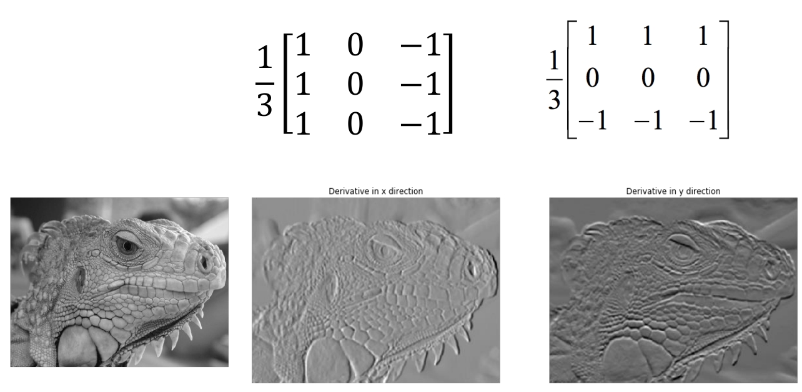
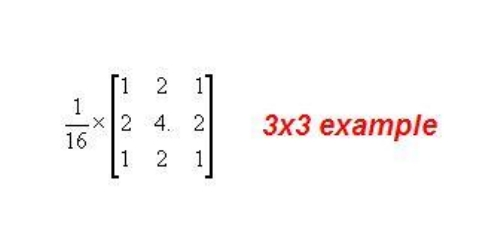
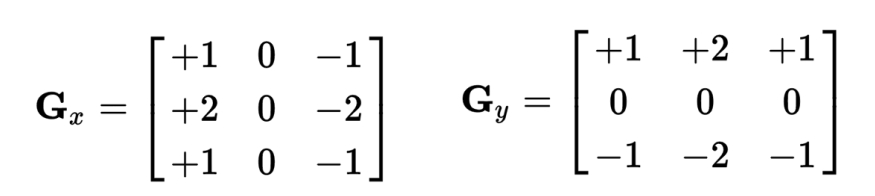
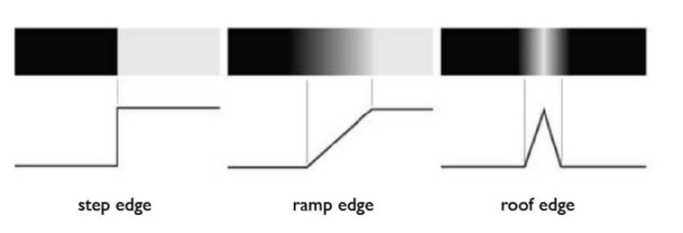

# 滤波器（Filter）
## 滤波器简介
简单来说，滤波器是一种简单的图像处理单元，应用的对象为图像中的某个像素，这里可以将某种滤波器记为$S$，对于有$n$行$m$列的某图像$f$，对其使用滤波器$S$后得到图像$g$，则记为$f\xrightarrow{S} g$

## 常见滤波器举例
下面均以3x3大小的滤波器为例。
### Average
简单来说，通过滤波器后，每个像素值变为该像素周围9个像素点原值的平均值，起到平滑（模糊）图像的效果。

公式表示为：

$g[i,j] = \frac{1}{9}\sum_{k=i-1}^{k=i+1}\sum_{l=j-1}^{l=j+1}f[k,l]$

### Sharpening
每个像素值变为原来的2倍，然后减去其周围9个像素点原值的平均值，起到锐化图像的效果。

### Shift
平移图像

### 边界值填充

当滤波器应用于图像边缘的像素时，会面临目标像素周围为空的情况，此时可以考虑以下方法：
- zero padding：空位均当“0”处理。
- edge value replication：复制边界像素的值，将其填充到对应的空位中。
- mirror extension：当滤波器需要读取图像外的某个空位的“像素”时，按图像边缘为对称轴，读取图像内对应位置的像素。

## 滤波器性质
### shift invariant（平移不变性）
若先平移图像，再使用滤波器，结果和先使用滤波器，再平移图像一致，则称该滤波器具有平移不变性。
### linear（线性）
对于滤波器$S$，对于图像$f$，将其某个像素值$f[i,j]$乘以$\alpha$后使用滤波器，有$S(\alpha f[i,j])$。对于另一像素值$f[k,l]$，将其乘以$\beta$后使用滤波器，有$\beta f[k,l]$。若$S(\alpha f[i,j] + \beta f[k,l]) = \alpha S(f[i,j]) + \beta S(f[k,l])$。则称滤波器$S$为线性滤波器。

  

# 滤波器高级应用：边缘检测
## 无噪点图像的边缘检测
图像所呈现物体的“边缘”，其对应的像素值与临近像素值大相径庭。因此，可参考“导数”的思路，检测某像素附近的“变化率”，若“变化率”过大，说明此像素处于物体的边缘。

$\frac{df}{dx} = \lim _{\Delta x \to 0}\frac{f(x)-f(x-\Delta x)}{\Delta x} = f^{'}(x)$

对于一维的图像，假设$x$为像素坐标，$f(x)$为像素值，由于相邻像素的$\Delta x$恒为1，一般可近似通过以下公式求变化率：

$f^{'}(x) = f(x) - f(x-1)$

有时为了对称性，也会使用以下公式：

$f^{'}(x) = f(x+1) - f(x-1)$

将上述公式拓展到二维，则可得到的以下求变化率的滤波器：

如图，可使用所示滤波器分别对X轴方向和Y轴方向的像素变化率进行计算。从而检测出X轴方向的边缘和Y轴方向的边缘。

## 有噪点图像的边缘检测（Sobel edge detector）

对于有噪点图像，噪点处的像素与其相邻像素值差别也会比较大，则就会影响边缘检测。对此，需要先对此类图像进行平滑处理，上述的Average滤波器以及Median滤波器、高斯模糊滤波器都是较为常用的方法。

3x3 Median滤波器简单来说就是将当前像素值替换为周围3x3范围内所有像素值的中位数。

高斯模糊滤波器本质上是一种加权平均版本的Average滤波器，越靠近中心的像素权重越高。

在完成上述平滑图像的操作后，就可以使用求变化率的滤波器来进行边缘检测了。

实际上，我们可以将上述两个步骤结合。原来的步骤是先平滑图像，再求变化率。实际上可以对平滑图像的滤波器求变化率，然后用得到的滤波器应用于图像中，即可一步到位进行噪点处理和边缘检测。

如图是对高斯模糊滤波器求变化率后得到的滤波器，此类滤波器被称为“Sobel edge detector”，可直接应用到含噪点的图像中进行边缘检测。

Sobel edge detector虽然解决了噪点问题，但仍有其局限性。如图，Sobel edge detector仅在第一种较为明显的边缘上有不错的检测效果。对于第二种过渡稍微平滑一点的边缘检测效果不佳。对于第三种这种“尖峰”式的边缘容易出现漏检的情况。

## Canny edge detector

