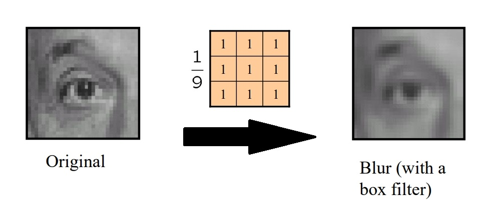
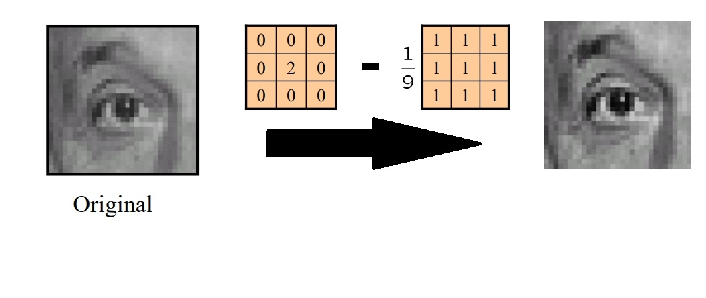
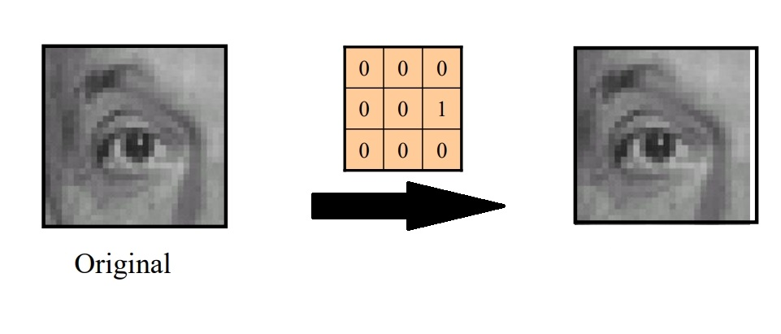

# 滤波器（Filter）
## 滤波器简介
简单来说，滤波器是一种简单的图像处理单元，应用的对象为图像中的某个像素，这里可以将某种滤波器记为$S$，对于有$n$行$m$列的某图像$f$，对其使用滤波器$S$后得到图像$g$，则记为$f\xrightarrow{S} g$

## 常见滤波器举例
下面均以3x3大小的滤波器为例。
### Moving Average
简单来说，通过滤波器后，每个像素值变为该像素周围9个像素点原值的平均值，起到平滑（模糊）图像的效果。

公式表示为：

$g[i,j] = \frac{1}{9}\sum_{k=i-1}^{k=i+1}\sum_{l=j-1}^{l=j+1}f[k,l]$

### Sharpening
每个像素值变为原来的2倍，然后减去其周围9个像素点原值的平均值，起到锐化图像的效果。

### Shift
平移图像

### 边界值填充

当滤波器应用于图像边缘的像素时，会面临目标像素周围为空的情况，此时可以考虑以下方法：
- zero padding：空位均当“0”处理。
- edge value replication：复制边界像素的值，将其填充到对应的空位中。
- mirror extension：当滤波器需要读取图像外的某个空位的“像素”时，按图像边缘为对称轴，读取图像内对应位置的像素。

## 滤波器性质
### shift invariant（平移不变性）
若先平移图像，再使用滤波器，结果和先使用滤波器，再平移图像一致，则称该滤波器具有平移不变性。
### linear（线性）
对于滤波器$S$，对于图像$f$，将其某个像素值$f[i,j]$乘以$\alpha$后使用滤波器，有$S(\alpha f[i,j])$。对于另一像素值$f[k,l]$，将其乘以$\beta$后使用滤波器，有$\beta f[k,l]$。若$S(\alpha f[i,j] + \beta f[k,l]) = \alpha S(f[i,j]) + \beta S(f[k,l])$。则称滤波器$S$为线性滤波器。

  

edge detection 40页
