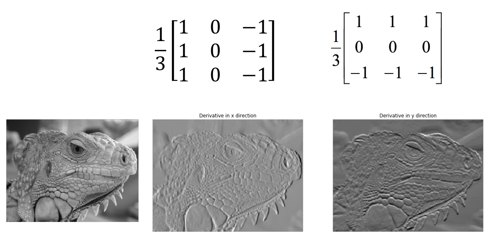

# 滤波器（Filter）
## 滤波器简介
简单来说，滤波器是一种简单的图像处理单元，应用的对象为图像中的某个像素，这里可以将某种滤波器记为$S$，对于有$n$行$m$列的某图像$f$，对其使用滤波器$S$后得到图像$g$，则记为$f\xrightarrow{S} g$

## 常见滤波器举例
下面均以3x3大小的滤波器为例。
### Average
简单来说，通过滤波器后，每个像素值变为该像素周围9个像素点原值的平均值，起到平滑（模糊）图像的效果。

公式表示为：

$g[i,j] = \frac{1}{9}\sum_{k=i-1}^{k=i+1}\sum_{l=j-1}^{l=j+1}f[k,l]$


### Sharpening
每个像素值变为原来的2倍，然后减去其周围9个像素点原值的平均值，起到锐化图像的效果。


### Shift
平移图像


### 边界值填充

当滤波器应用于图像边缘的像素时，会面临目标像素周围为空的情况，此时可以考虑以下方法：
- zero padding：空位均当“0”处理。
- edge value replication：复制边界像素的值，将其填充到对应的空位中。
- mirror extension：当滤波器需要读取图像外的某个空位的“像素”时，按图像边缘为对称轴，读取图像内对应位置的像素。


## 滤波器性质
### shift invariant（平移不变性）
若先平移图像，再使用滤波器，结果和先使用滤波器，再平移图像一致，则称该滤波器具有平移不变性。
### linear（线性）
对于滤波器$S$，对于图像$f$，将其某个像素值$f[i,j]$乘以$\alpha$后使用滤波器，有$S(\alpha f[i,j])$。对于另一像素值$f[k,l]$，将其乘以$\beta$后使用滤波器，有$\beta f[k,l]$。若$S(\alpha f[i,j] + \beta f[k,l]) = \alpha S(f[i,j]) + \beta S(f[k,l])$。则称滤波器$S$为线性滤波器。

<br/><br/>

# 滤波器高级应用：边缘检测
## 无噪点图像的边缘检测
图像所呈现物体的“边缘”，其对应的像素值与临近像素值大相径庭。因此，可参考“导数”的思路，检测某像素附近的“变化率”（或者说，梯度），若梯度过大，说明此像素处于物体的边缘。

$\frac{df}{dx} = \lim _{\Delta x \to 0}\frac{f(x)-f(x-\Delta x)}{\Delta x} = f^{'}(x)$

对于一维的图像，假设$x$为像素坐标，$f(x)$为像素值，由于相邻像素的$\Delta x$恒为1，一般可近似通过以下公式求梯度：

$f^{'}(x) = f(x) - f(x-1)$

有时为了对称性，也会使用以下公式：

$f^{'}(x) = f(x+1) - f(x-1)$

将上述公式拓展到二维，则可得到的以下求梯度的滤波器：


如图，可使用所示滤波器分别对X轴方向和Y轴方向的像素梯度进行计算。从而检测出X轴方向的梯度图和Y轴方向的梯度图，这两张图分别呈现了沿X轴方向的边缘和Y轴方向的边缘。

最后我们将上述两张图综合起来，得到完整的边缘检测结果（即梯度图）。对于梯度图任意位置的像素$G$，假设$G_x$为X轴方向梯度图对应位置的像素，$G_y$为Y轴方向梯度图对应位置的像素，则有：$G = \sqrt{G_x^2+G_y^2}$

## 有噪点图像的边缘检测（Sobel edge detector）

对于有噪点图像，噪点处的像素与其相邻像素值差别也会比较大，则就会影响边缘检测。对此，需要先对此类图像进行平滑处理，上述的Average滤波器以及Median滤波器、高斯模糊滤波器都是较为常用的方法。

3x3 Median滤波器简单来说就是将当前像素值替换为周围3x3范围内所有像素值的中位数。

高斯模糊滤波器本质上是一种加权平均版本的Average滤波器，越靠近中心的像素权重越高。



在完成上述平滑图像的操作后，就可以使用求梯度的滤波器来进行边缘检测了。

实际上，我们可以将上述两个步骤结合。原来的步骤是先平滑图像，再求梯度。实际上可以对平滑图像的滤波器求梯度，然后用得到的滤波器应用于图像中，即可一步到位进行噪点处理和边缘检测。


如图是对高斯模糊滤波器求梯度后得到的滤波器，此类滤波器被称为“Sobel edge detector”，可直接应用到含噪点的图像中进行边缘检测。使用以上两种滤波器分别求出X、Y轴方向梯度图后用相同方式生成完整的梯度图：$G = \sqrt{G_x^2+G_y^2}$

Sobel edge detector虽然解决了噪点问题，但仍有其局限性。如图，Sobel edge detector仅在第一种较为明显的边缘上有不错的检测效果。对于第二种过渡稍微平滑一点的边缘检测效果不佳。对于第三种这种“尖峰”式的边缘容易出现漏检的情况。此外，对于较粗的边缘（物体的轮廓线比较粗），Sobel edge detector会将边缘与两边物体的接触处认成两处边缘，因此使用Sobel edge detector生成的图像边缘会显得比较粗。


## Canny edge detector

Canny edge detector是使用最为广泛的一种边缘检测滤波器。其流程主要为下：
1. 使用Sobel edge detector；
2. 抑制非极大值；为了解决Sobel edge detector在较粗边缘多次触发其检测的问题，需要在第一步的结果上进行非极大值抑制处理。检查每个像素是否是其梯度方向上的局部最大值。如果是，则保留该像素，否则直接则置0。这一步骤可以令第一步检测出的边缘“变细”。值得注意的是，像素的梯度方向可能是0到360度中任意一个，我们只需要将该像素与与梯度方向最接近的两个邻接像素对比，只要该像素比那两个邻接像素大即可认为是局部最大值。


梯度方向一般与边缘方向垂直，如图所示的的梯度方向与X轴夹角约为105度，与该梯度方向最接近的两个邻接像素是上下两个方向的邻接像素。

3. 迟滞阈值；在这一步骤需要设置两个阈值low和high。然后对第二步得到的结果进行如下处理：检测每个像素值，若高于high，则说明是“强边缘”，则进行保留；若低于low，则说明不是边缘，直接置0；若在low和high之间，则查看该像素是否与“强边缘”相连，如果是则也视为边缘并保留，否则置0。

完整Python代码如下：
```py
from PIL import Image
import numpy as np
from collections import deque
from scipy import ndimage


def Sobel(arr):
    Gx_filter = np.array([[1, 0, -1], [2, 0, -2], [1, 0, -1]])
    Gy_filter = np.array([[1, 2, 1], [0, 0, 0], [-1, -2, -1]])
    Gx = ndimage.convolve(arr, Gx_filter)
    Gy = ndimage.convolve(arr, Gy_filter)
    G = np.sqrt(Gx*Gx+Gy*Gy)
    return G, Gx, Gy


def Suppress(G, Gx, Gy):
    n, m = G.shape
    G_suppress = G.copy()
    theta = np.arctan2(Gy, Gx) * 180 / np.pi    # 为每个像素计算其梯度方向
    neighbor1 = 0
    neighbor2 = 0

    for i in range(1, n-1):
        for j in range(1, m - 1):
            if -22.5 <= theta[i][j] <= 22.5 or 157.5 <= abs(theta[i][j]) <= 180:
                neighbor1 = G[i][j+1]
                neighbor2 = G[i][j-1]
            if 22.5 <= theta[i][j] <= 67.5 or -157.5 <= theta[i][j] <= -112.5:
                neighbor1 = G[i+1][j+1]
                neighbor2 = G[i-1][j-1]
            if 67.5 <= abs(theta[i][j]) <= 112.5:
                neighbor1 = G[i+1][j]
                neighbor2 = G[i-1][j]
            if -67.5 <= theta[i][j] <= -22.5 or 112.5 <= theta[i][j] <= 157.5:
                neighbor1 = G[i+1][j-1]
                neighbor2 = G[i-1][j+1]
            if G[i][j] > neighbor1 and G[i][j] > neighbor2:
                G_suppress[i][j] = G[i][j]
            else:
                G_suppress[i][j] = 0

    return G_suppress


def HysteresisThresholding(G, low, high):
    G_result = G.copy()
    isVisit = np.zeros(G.shape, dtype=bool)
    n, m = G.shape
    xx = [0, 0, -1, -1, -1, 1, 1, 1]
    yy = [-1, 1, 1, 0, -1, 1, 0, -1]

    for i in range(n):              # 使用BFS找到所有的“强边缘”以及和“强边缘”相连的“普通边缘”
        for j in range(m):
            if G[i][j] >= high and isVisit[i][j] == False:   
                q = deque([(i, j)])
                isVisit[i][j] = True
                now = 0
                while q:
                    now_i, now_j = q.popleft()
                    for k in range(8):
                        next_i = now_i + xx[k]
                        next_j = now_j + yy[k]
                        if (0 <= next_i < n and 0 <= next_j < m and G[next_i][next_j] > low and isVisit[next_i][next_j] == False):
                            isVisit[next_i][next_j] = True
                            q.append((next_i, next_j))     

    for i in range(n):
        for j in range(m):    
            if isVisit[i][j] == False:
                G_result[i][j] = 0
            else:
                G_result[i][j] = 255

    return G_result


def Canny(img, low, high):
    gray = img.convert('L')  # RGB转灰度图
    arr = np.asarray(gray, dtype=np.float64)    # 将灰度图转成numpy形式

    G, Gx, Gy = Sobel(arr)                                   # 第一步：使用Sobel edge detector
    G_suppress = Suppress(G, Gx, Gy)                         # 第二步：非极大值抑制
    G_result = HysteresisThresholding(G_suppress, low, high) # 第三步：迟滞阈值

    min, max = G_result.min(), G_result.max()         # 将numpy形式的结果图转换回图像形式
    if min < 0 or max > 255:
        G_result = (G_result - min)/(max-min)*255  # 归一化处理，令像素值从回0到255的范围
    G_result = G_result.astype(np.uint8) 

    return Image.fromarray(G_result)


low = 180
high = 256
img_path = 'road.jpg'
save_path = 'result.jpg'

img = Image.open(img_path)
result = Canny(img, low, high)
result.save(save_path)
```
<br/><br/>


## Hough transform

可参考：[（四十八）通俗易懂理解——霍夫变换原理](https://zhuanlan.zhihu.com/p/203292567)