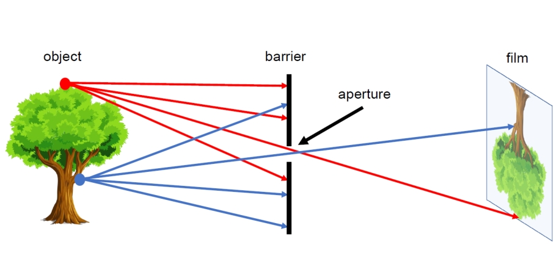
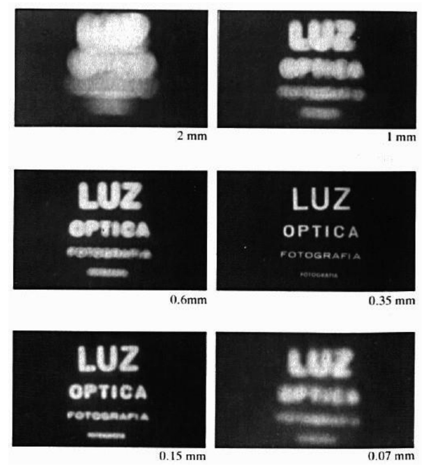
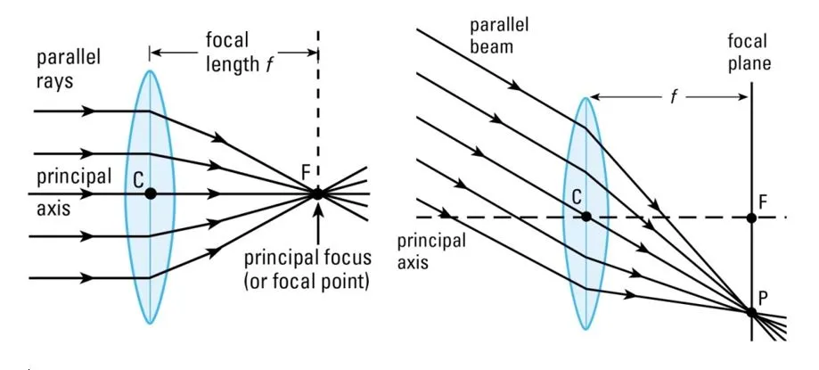
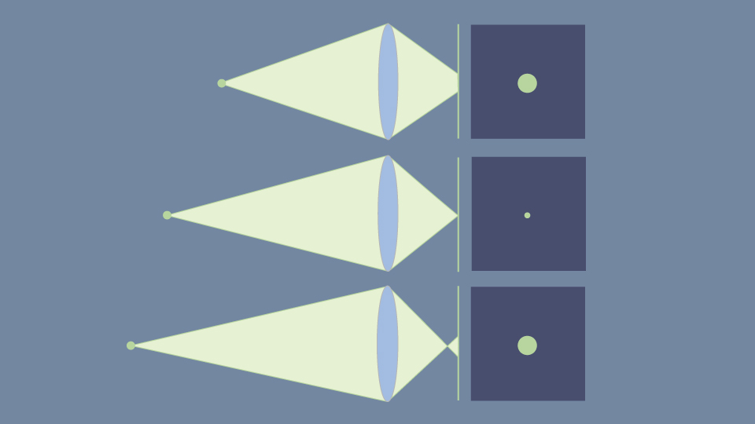
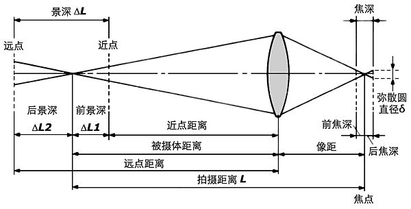
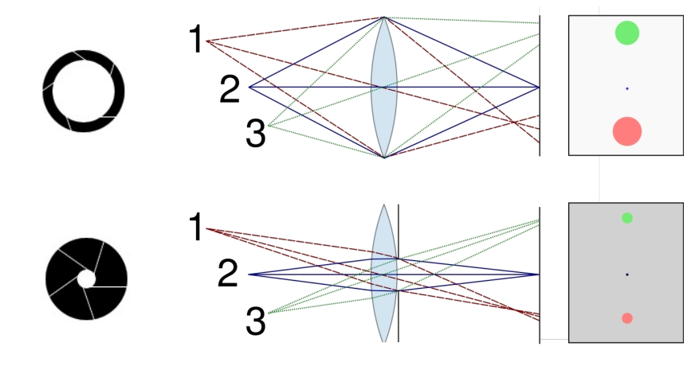
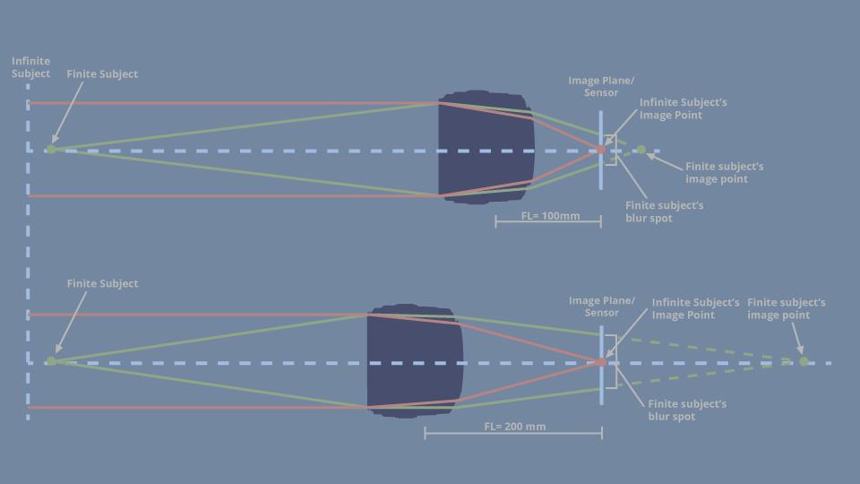
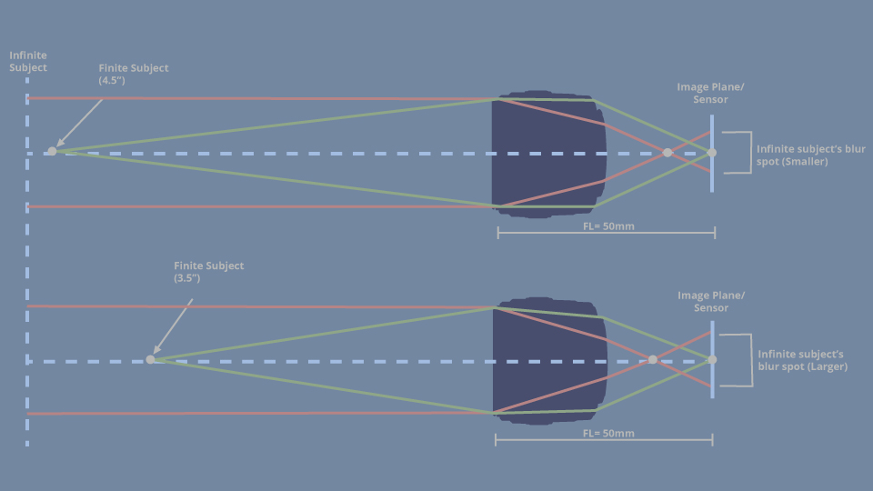
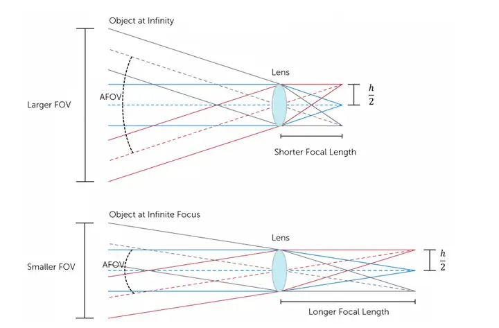

# 光圈（Aperture）

如图所示，可自行发光的物体发射出的光线透过较小的空隙在胶片上呈现出物体倒置的的像。这个小孔我们称之为“光圈”。

当光圈在一定程度内缩小，由于进光量减少，所呈的像的亮度会降低，但是遮挡住的“散漫”的光线更多，所呈的像的边缘就越清晰。然而，当光圈过小时，由于光的衍射现象，成像会变得模糊。

如果既要小光圈带来的清晰成像效果，又希望成像亮度更高，可以考虑提高曝光度。
  

# 透镜（Lens）
透镜可将通过其的平行光汇聚到一个点上，该点称为焦点（focal point），焦点与透镜的水平距离为焦距（focal length）。

如下图所示，通过透镜的平行光无论是否平行于透镜的主轴（principal axis），最终的焦点均在一个平面上，该平面称为焦平面（focal plane）。

不同的透镜有不同的焦距，对于某个透镜而言，其焦距为其固有的属性，不因其他因素改变。

  

# 景深（Depth of Field）

当物体与透镜存在一个特定的距离时，通过透镜的光线才能恰好汇聚到焦点上，从而呈现出清晰的像，此时称为聚焦（in focus）。如果物体稍远或稍近，则会呈现出模糊的像，此时称为虚焦（out of focus），这些模糊的像称为弥散圆（circle of confusion）。

当物体与透镜存在一个最远/最近距离，使得成像虽然没有完全in focus，但人眼也难以感知时，这两个距离之间的距离称为景深。

## 影响景深的因素
### 光圈大小
当缩小光圈时，一般景深会变大。

### 焦距
当使用更短焦距的镜头时，景深也会变大。

### 物体与镜头的距离
一般物体距离镜头更远时，景深更大。

## 不同景深的镜头设置
- 深焦（deep focus）：景深非常大的一种镜头设置，在深焦镜头下，近处和远处的物体均能in focus。
- 浅焦（shallow focus）：
景深非常浅的一种镜头设置，在浅焦镜头下，仅有近处或中间的物体能in focus。

  

# 视场角（Field of View）
即相机成像的视野范围。视场角越大，拍摄到的照片视野范围就越大。一般可按照视场角给镜头分类。角度在45°左右的为标准镜头，60至80°的为广角镜头，80至120°左右的为超广角镜头，角度更大的则叫鱼眼镜头。

视场角与镜头焦距和传感器有关。当焦距固定时，图像传感器的尺寸越大，视场角也就越大。当图像传感器的尺寸不变时，焦距越短，视场角越大。

  

# 参考资料
[Where is the focal point?](https://evantoh23.wordpress.com/2019/01/10/where-is-the-focal-point/)

[Depth of Field, Part I: The Basics](https://www.bhphotovideo.com/explora/photography/tips-and-solutions/depth-of-field-part-i-the-basics)

[File:Depth of field illustration.svg](https://en.wikipedia.org/wiki/File:Depth_of_field_illustration.svg)

[什么是视场角？它的大小是由镜头还是传感器决定的？](https://zhuanlan.zhihu.com/p/486600045)