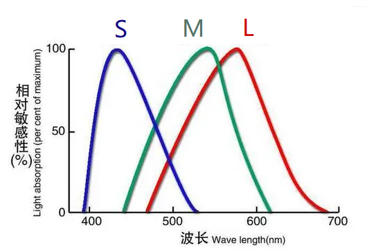

# 何谓“色彩”
所谓的“色彩”，实际上是物理现象，生物反应以及心理作用共同作用下的结果。

## 色彩并不是光的属性

我们看到的各种颜色，本质是上不同波长的光的混合。我们通过后天的学习，将各种颜色概念与这些我们看到的不同类型的光进行对应。因此，色彩是我们后天学习到的概念，而不是光本身的性质或属性。人类可以用色彩去区分不同的光，在物理学中，仅需通过光的波长以及各种光的混合比例等参数去区分即可。

## 人眼的生物学特性与色彩的关系

人眼中存在三种不同的视锥细胞S、M、L，这三种细胞分别对三个波段的光较为敏感。当我们看到某种波长的光时，由于不同视锥细胞对不同波长的光的敏感性不同，因此不同的视锥细胞，被激活的比例也不同，这些被激活的细胞会向大脑发出不同比例的电信号，从而让大脑辨别出这是某一种光。例如当看到450nm的光时，90%的S细胞被激活，但M细胞可能仅激活了10%，L细胞完全无感。那么大脑接受到大量的S细胞发出的信号和少量M细胞发出的信号，这种信号比例，让大脑知道看到的是“蓝色”这种光。我们后天的学习中，将“蓝色”这个概念与这种光联系起来后，我们才将这种光为蓝色光。

## 心理作用与色彩的关系

如图，我们可以说看到一辆蓝色的小汽车，但实际上，小汽车发射的并非蓝光。只是在相对于粉色的背景中，我们人眼感觉到车是蓝色的。

## 总结

综上所述，色彩其实是一个非常复杂的人造概念，本文仅作简单探讨，不会涉及物理学、生物学及心理学更深层次的讨论。下文仅涉及色彩在计算机多媒体文件中的一些概念与应用。

  

# 三原色与色彩相加/相减原理

## 色光三原色
我们看到的发光体（例如显示器、灯）的颜色，是受到发光体发射出的光所决定的。这些光的颜色遵循相加原则，不同的光混合，得到的光能量更强，亮度更高。

我们所熟知的RGB（红、绿、蓝）被称为色光三原色（Primary Colors of Light）。这三种颜色的光全部混合可得到白光，而两两混合可得到以下三种颜色的光: 黄（yellow，红+绿）、品红（magenta，红+蓝）、青（cyan，绿+蓝）。

## 色料三原色
非发光体的颜色取决于其反射的光。举个不太严谨的例子，阳光下呈现红色的苹果，这是由于白光照射时，苹果吸收掉了绿光和蓝光，仅反射出了红光。因此在我们看来，苹果呈现红色。

对于非发光体，我们所熟知的红黄蓝（实际上是品红（magenta）、黄、青色（cyan），也就是上面色光三原色两两混合得到的颜色）被称为色料三原色（Primary Colors of Pigments，也可称为Secondary Color of Light）。非发光体的颜色混合，遵循相减原则。例如黄色颜料和品红颜料混合会得到红色。这是因为黄色颜料吸收掉了白色光中的蓝光，其反射出的绿光和红光混合让人看起来是黄的。同理，品红颜料吸收掉的白色光中的绿光，反射出红光和蓝光混合出的品红色的光。那这两种颜料混合，会得到一种既吸收蓝光又吸收绿光的颜料，因此就会呈现红色。

理论上来说，色料三原色混合会得到黑色（然而在现实中很难做到）。

  

# 色光的基本性质
## 光谱
白光通过色散系统（如三棱镜）后会呈现出彩虹一样的色带（即可见光谱）。色带上呈现出的颜色被称为光谱色，这些颜色可通过单一波长的光来呈现，也可通过混合不同波长的光呈现。同理，不在色带上的颜色被称为非光谱色，这些颜色只能通过混合不同波长的光来呈现。

## 消色差光（Achromatic Light）与彩色光（Chromatic Light）
消色差光又称白光、混合光，可混合多种有色光得到，简单来说，就是黑白屏幕显示出的，仅黑、白、灰这一类颜色的光。消色差光通过强度（intensity，the amount of grey level）来衡量其颜色。

彩色光即呈现出各种颜色的光。

## 光的物理性质
Radiance、Luminance、Brightness这些参数来描述其物理性质。

- Radiance用来描述从单位时间内从光源发射出的能量总数，单位为Watt（瓦）。
- Luminance和Brightness一般都称为亮度，但Luminance是亮度的客观衡量，描述了单位时间内从光源发出的可见光的总量，单位为Lumens（流明）。
- Brightness为亮度的主观感受。不同的人对同一光源可能有不同的亮度感知。

## 光的色彩性质
Brightness、Hue、Saturation一般用于描述彩光的色彩，日常也是通过这些参数来将不同颜色的光区分开来。

- Hue（色调，色相）：用来指代这种光所呈现出的主要颜色。例如我们所说的红光、蓝光、紫光，红、蓝、紫就是这些光的Hue。
- Saturation（饱和度）：即光的纯度。单一波长的光呈现出的颜色饱和度最高（也就是说，光谱色的饱和度最高），混合光呈现出的颜色饱和度一般会低一些。直观感受上，高饱和度的颜色看起来更鲜艳。

  

# 色彩模型
## CIE

人眼到底能看到多少种颜色，这些颜色能否仅凭三原色的色光复现出来呢？对此进行了色彩匹配实验，实验结果通过一系列变换后得到了如下这张CIEL色度图：

图中“驼峰”上任意一点对应的横坐标为红光的比例，纵坐标为绿光的比例。由于三原色光的比例总和为1，因此知道横纵坐标后也能算出蓝光的比例。如图，上面红圈圈起来的颜色表示其通过混合62%的绿光，25%的红光以及13%蓝光得来.

图中“驼峰”边缘为各种光谱色，这些光谱色既能通过单一波长的光呈现，也可按图中所示混合三原色光呈现。

图中下方红圈所指的点为白色，该点称为“等能白点”（point of equal energy），通过混合相同比例的三原色光得到。

### 色域
在驼峰中任取两点，该两点的连线上的所有颜色都可通过该线段两端对应色光通过不同比例的混合得到。而在驼峰上任取三点，三点连成的三角形内的所有颜色都可通过三角形三个顶点所代表色光混合得到。因此，如果我们有三束稳定的色光，则可呈现出对应三角形中的所有颜色，这个三角形称为这三束色光的色域。

我们常见的sRGB， Adobe RGB，NTSC，DCI-P3等的都是不同的色彩标准，在选购显示器时常见。它们的色域分别为如下所示：

## RGB

老熟人了，在计算机中RGB的每个颜色通道使用8 bit来表示，总共可以表示2^24种颜色。

### Safe RGB
早期的很多老旧显示器无法支持更丰富的色彩，可能最多仅能显示256种颜色。对此有一种称为Safe RGB的编码方案。24-bit RGB的每个颜色通道取值范围为0-255，在Safe RGB中，我们每个颜色通道仅取6个值，因此在0-255的范围中，我们每隔$255/5 \approx 51$取一次值，这样一来，每个颜色通道都取0、51、102、153、204、255这六个值，然后Safe RGB标准下就有6^3=216种颜色。之后再另外加上40种补充颜色，形成这种兼容老式显示器的256色显示方案。

早些年在网页设计中，可能还会推荐使用Safe RGB格式来兼容老式显示器，现在大可不必了。

## CMY/CMYK

该标准一般称为CMYK（K取自Black的尾字母）。一种常用于印刷行业的色彩标准。CMY即色料三原色的首字母。由于现实中混合色料三原色无法得到黑色，因此一般还要额外加上黑色颜料才能混合出各种需要的色彩。

## HSI
一种基于Hue、Saturation、Intensity（Brightness）的色彩模型。和RGB之间可以互相换算。其中Hue一般以角度表示，其取值范围为$0^\circ \to 360^\circ$。人眼一般可以区分相隔$30^\circ$的色相。
### HSI to RGB 

当$0 \leq H < 120^{\circ}$：

$B = I(1-S) $

$R = I [1+\frac{S\cos H}{\cos(60^{\circ}-H)}]$

$G = 3I-R-B$
  

当$120 \leq H < 240^{\circ}$：

首先令 $H -= 120^{\circ}$

$R = I(1-S) $

$G = I [1+\frac{S\cos H}{\cos(60^{\circ}-H)}]$

$B = 3I-R-G$
  

当$240 \leq H < 360^{\circ}$：

首先令 $H -= 240^{\circ}$

$G = I(1-S) $

$B = I [1+\frac{S\cos H}{\cos(60^{\circ}-H)}]$

$R = 3I - G - B$
  

### RGB to HSI
$\theta = \arccos \frac{(R-G+R-B)/2}{\sqrt{(R-G)^2+(R-B)(G-B)}}$

当$ B > G$， $H = 360^{\circ} - \theta$
当$ B \leq G$，$H = \theta$

$S = 1 - \frac{3}{R+G+B}min(R,G,B)$

$I = (R+G+B)/3$

# 参考资料及部分图片出处
[为什么自然光的连续光谱会有二维色域结构？ - Eary的回答 - 知乎](https://www.zhihu.com/question/629018381/answer/3307653185)

[人眼中三种视锥细胞分别是红绿蓝，那为什么我们能感受到紫色单色光？ - 曹工的回答 - 知乎](https://www.zhihu.com/question/451399075/answer/1802228666)