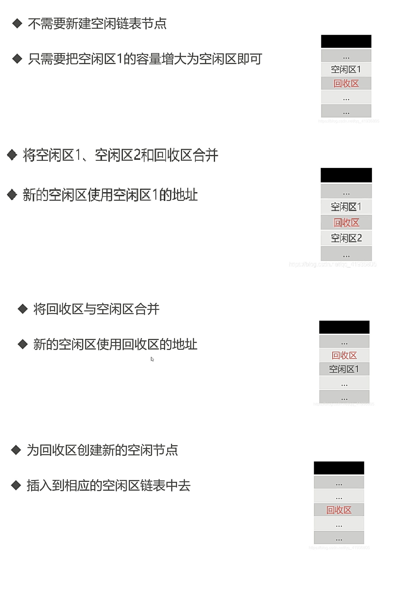

# 操作系统原理
## 用户态与内核态
### CPU指令集与权限
CPU指令集是CPU操作软硬件的媒介，每一条汇编语句都对应了一条CPU指令。多条指令就构成了指令集。

实际上，有些指令的操作风险比较大，如果仍由用户随意使用可能会导致严重后果。对此，CPU指令集被划分出权限：ring 0、1、2、3。其中ring 0 权限最高，可以使用全部指令集。ring 3权限最低，很多能直接操作硬件的指令集（例如硬盘IO、网卡访问、申请内存等）被禁止使用。Linux系统仅采用ring 0 和 ring 3 这2个权限。其中ring 0称为内核态，在操作系统内核中运行。ring 3称为用户态，在应用程序中运行。


## 进程管理

### 进程与线程

### 进程通信

进程通信（InterProcess Communication，IPC）就是指进程之间的信息交换。由于每个进程的地址空间都是独立的，


### 进程调度算法

### 死锁
#### 死锁产生的必要条件
1. 互斥条件：资源被进程独占且排他地使用。任意时刻一个资源只能给一个进程使用。
2. 不可剥夺条件：进程获得的资源在未使用完毕之前，不可被其他进程剥夺。
3. 请求和保持条件：进程在申请新资源时，对于已有的资源也持续占有。
4. 循环等待条件：例如，进程2在等待进程1释放其占有的资源，进程3等待进程2释放其占有的资源 ... 进程n等待进程1释放其占有的资源

## 内存管理

### 虚拟内存


### 内存分配
采用空闲区链表法，内存分配可以分为单一连续分配（已经过时）、固定分区分配和动态分区分配（根据实际需要，动态的分配内存）三种方法，其中动态分区分配有三种算法：

- 首次适应算法（first fit）：每次从头开始顺序查找合适的空闲内存块。由于每次都是从头开始找，因此头部的内存空间会被很快消耗完，后续的内存查找效率会变低。

- 下次适应算法（next fit）：和首次适应算法相似，但每次查找不从头开始，而是从上次分配的内存地址开始。

- 最佳适应算法（best fit）：空闲区链表按照容量从小到大排序，遍历空闲区链表从而找到首个合适的空闲区，因此每次都是分配出去一个最小的内存空间。

- 最坏适应算法（worst fit）：空闲区链表按照容量从大到小排序，遍历空闲区链表从而找到首个合适的空闲区，因此每次都是从最大的空闲区中分配出去一部分。

- 快速适应算法：多个空闲区链表，每个空闲区链表中仅有一种容量的空闲区节点。

### 内存回收
四种情况：


### 大端模式/小端模式
大端模式：多字节的数据从低地址依次存储到高地址。例如：
```cpp
short a = 0xffee;

// 地址0x1000存储ff，地址0x1001存储ee
```

小端模式：反过来。

## 单缓冲和双缓冲
### 作用
缓和CPU与I/O设备速度不匹配的矛盾，提高CPU与I/O设备的并行性。

减少对CPU的中断频率。CPU处理完的数据可直接丢到缓冲区，再让缓冲区慢慢操作到I/O设备中，让CPU腾出手来干别的。
### 单缓冲
数据移动的流程：

磁盘块 --> 缓冲区 --> 用户区 

移动到用户区后CPU即可开始处理数据。其中，数据从磁盘块写入缓冲区这一步骤和用户区从缓冲区拿取数据这一步骤不可并行。

CPU在处理数据可以和缓冲区的操作并行。

假设有$n$个磁盘块的数据，每块数据写到缓冲区需要$t_1$的时间，缓冲区写到用户区需要$t_2$的时间，CPU处理需要$t_3$的时间，则所有数据处理完需要：

如果 $t_3 > t_1 $，则：$n \times (t2+t3) + t1$

如果 $t_1 > t_3 $，则：$n \times (t1+t2) + t3$

无论何种情况，单缓冲下每块数据平均处理时间为$ max(t_1, t_3) + t_2$

### 双缓冲

数据从磁盘块写入缓冲区这一步骤和另外两个步骤均可并行。
如果 $t_2 + t_3 > t_1 $，则：$n \times (t2+t3) + t1$

如果 $t_2 + t_3 < t_1 $，则：$n \times t_1 + t_2 + t_3$

无论何种情况，双缓冲下每块数据平均处理时间为$ max(t_1,  t_2+ t_3)$


### 乐观锁/悲观锁
悲观锁基于悲观的思想，它假定两个事务同时对数据修改时必定发生冲突。对此，悲观锁会在读取某个数据时加锁，直到事务完成才释放锁。

乐观锁基于乐观的思想，认为多个事务并发修改同一条数据的情况很少发生。因此，在整个数据处理过程中不会加锁。在乐观锁场景下，事务在读取到数据时会加上版本号字段或时间戳字段。在更新数据时，会先检查这个字段是否有变化。如果有变，说明其他事务对数据进行了修改，当前事务就会放弃。如果没变，则当前事务可以修改数据，并更新字段。

<br/><br/>

# 数据结构

## n个元素出栈有多少种不同情况

$\frac{C_{2n}^{n}}{n+1}$

## 树的高度与深度


## 邻接表和邻接矩阵
邻接矩阵：a[i][j]表示点i和点j的连接情况（有权图中表示边的权值，无权图中为1表示存在边）。无向图的邻接矩阵是沿对角线对称的

邻接表：a[i]存储一个链表，链表中的多个元素都是与点i相连的点
## 有向无环图描述表达式


## 线索二叉树
普通二叉树中，叶子节点指向左右子树的指针为NULL，但在线索二叉树中指向其前驱节点与后继节点，这样一来可以以较低的空间代价来存储树的遍历顺序，从而可以像链表一样使用树。

上文所述的“较低的空间代价”是指每个节点需要额外两个bit位：lflag和rfalg。其中lflag表示其左指针指向的是左子树节点还是前驱节点，rflag表示其右指针指向的是右子树节点还是后继节点。


## 跳表
### 简介


对于数据有序的单链表，通过逐层建立索引，来实现对指定元素的快速查找。

如图，对原始的单链表建立一级索引（每隔2个节点建一个索引节点）、二级索引（每隔4个节点建一个索引节点）、三级索引（每隔8个节点建一个索引节点）……

当查找元素时，从最高级索引来定位元素的范围，然后下降到次一级索引缩小元素的范围，直到下降到原始链表，找到指定元素。

当对跳表进行增删操作后，一般需要同步更新索引节点（时间复杂度也在$O(\log N)$内）。

### 时间复杂度与空间复杂度分析
跳表的查找、插入和删除操作可在$O(\log N)$时间内完成。空间复杂度一般是原始单链表的两倍（但也在$O(N)$范围内）。

跳表可以通过建立索引时间隔节点的数量来平衡其时间复杂度与空间复杂度，间隔的节点越多，索引节点就越少，空间消耗就少，但查找效率会降低。

跳表的特性与红黑树类似，但是在查找区间数据上，跳表表现要优于红黑树。因为跳表可在$O(\log N)$时间内定位到区间左端点，然后从该端点开始顺序遍历链表即可。

<br/><br/>

# 算法
## 排序算法
### 稳定性
除了冒泡，插入，归并，计数/桶/基数，其他都不稳定

### 非比较类排序
计数排序、桶排序、基数排序（先低位为桶，然后高位为桶）

### 各种算法的时间空间复杂度
| 算法 | 最坏 | 最好 | 额外空间 | 备注|
| -- | --| -- |-- | -- |
| 插入 | n^2| n  | 1 | |
| 希尔 | n^2| n |  1|  希尔的平均为n^1.3|
| 选择 | n^2| n^2  | 1 | |
| 冒泡 | n^2| n  |  1|  |
| 快速 | n^2| nlogn |logn | 递归需要额外空间，平均logn，最差n |
| 归并 | nlogn| nlogn | n| |
| 堆 | nlogn|  nlogn| 1| |


归并和堆的最好最坏都是nlogn，但快排最坏是n^2

### n^2算法的区别

以升序排序为例：

希尔排序：插入排序的优化版，先每gap个数为一组，组内插入排序，然后逐渐缩小gap，当gap=1后进行一次插入排序，就全部有序了。

冒泡：逐个比较相邻元素，让相邻两元素中，小的在大的前面。

插入排序：把待排序元素插入到有序部分的合适位置，原始数据越有序，插入排序效率越高

选择排序：在待排序部分中找出最小值放在有序部分的末尾


<br/><br/>

# Hadoop
Hadoop是一种大数据的分布式存储和计算框架，核心部件有HDFS（分布式文件存储系统）、YARN（分布式资源管理器）、MapReduce（分布式计算引擎）。

## Spark
分布式计算工具，计算结果放内存，对机器要求较高。

Hadoop是分布式框架, 包含计算, 存储, 调度等。

Spark核心：RDD（弹性分布式数据集）


<br/><br/>

# C/C++
## 运算符优先级
|优先级与结合性|运算符|描述|
|--|--|--|
|1（左到右 →）|::|作用域解析|
|2（左到右 →）|a++   a--|后缀自增与自减|
||type()   type{}|函数风格转换|
||a()|函数调用|
||a[]|下标|
||.   ->|成员访问|
|3（右到左 ←）|++a   --a|前缀自增与自减|
||+a   -a|一元加与减（正负号）|
||!   ~|逻辑非和逐位非|
||(type)|C 风格转换|
||*a|间接（解引用）|
||&a|取址|
||sizeof|取大小|
||co_await|await 表达式（C++20）|
||new   new[]|动态内存分配|
||delete   delete[]|动态内存释放|
|4（左到右 →）|.*   ->*|成员指针|
|5（左到右 →）|a*b a/b a%b|乘除与取模|
|6（左到右 →）|a+b a-b|加减|
|7（左到右 →）|<< >>|逐位左移与右移|
|8（左到右 →）|<=>|三路比较运算符（C++20）|
|9（左到右 →）|< <= > >=|小于、小于等于、大于、大于等于|
|10（左到右 →）|== !=|等于、不等于|
|11（左到右 →）|&|逐位与|
|12（左到右 →）|^|逐位异或|
|13（左到右 →）|\||逐位或|
|14（左到右 →）|&&|逻辑与|
|15（左到右 →）|\|\||逻辑或|
|16（右到左 ←）|a?b:c|三元条件|
||throw|throw 运算符|
||co_yield|yield 表达式 (C++20)|
||=|直接赋值（C++ 类默认提供）|
||+=   -=|以和及差复合赋值|
||*=   /=   %=|以积、商及余数复合赋值|
||<<= >>=|以逐位左移及右移复合赋值|
||&= ^= \|=|以逐位与、异或及或复合赋值|
|17（左到右 →）|,|逗号|从左到右 →|

## 结构体对齐
### 普通对齐

### 结构体嵌套

<br/><br/>

# 计算机网络

## 长连接与短连接

长连接：一个连接上可以连续发送多个数据包。

短连接：在数据传送过程中，只在需要发送数据时才去建立一个连接，数据发送完成后则断开此连接，即每次连接只完成一项业务的发送。

## 全连接和半连接

三次握手时，当客户端发送SYN后，服务器收到该SYN会将该通信放入半连接队列，并回复SYN ACK。当三次握手成功建立后，该通信才从半连接队列移动到全连接队列。