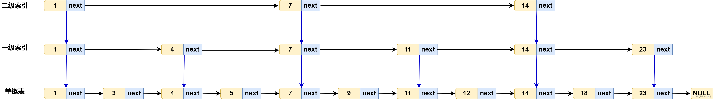

# 操作系统原理

## CPU与缓存管理
### 存储器分类
以下多种存储器，从左往右容量越大、访问以及执行速度越慢，价格越便宜，离CPU越远。
```
寄存器 -> L1缓存 -> L2缓存 -> L3缓存 -> 内存 -> 硬盘
```
其中，寄存器、L1-L3缓存都集成在CPU内部。CPU每个核心都有各自的L1、L2缓存。L3缓存是所有CPU核心共享的。

### 缓存命中
还没看
https://xiaolincoding.com/os/1_hardware/how_to_make_cpu_run_faster.html

### 缓存一致性
还没看
https://xiaolincoding.com/os/1_hardware/cpu_mesi.html


### 大端模式/小端模式
大端模式：多字节的数据从低地址依次存储到高地址，无论该数据存储于栈区还是堆区。例如：
```cpp
short a = 0xffee;

// 地址0x1000存储ff，地址0x1001存储ee
```

小端模式：反过来。

## 单缓冲和双缓冲
### 作用
缓和CPU与I/O设备速度不匹配的矛盾，提高CPU与I/O设备的并行性。

减少对CPU的中断频率。CPU处理完的数据可直接丢到缓冲区，再让缓冲区慢慢操作到I/O设备中，让CPU腾出手来干别的。
### 单缓冲
数据移动的流程：

磁盘块 --> 缓冲区 --> 用户区 

移动到用户区后CPU即可开始处理数据。其中，数据从磁盘块写入缓冲区这一步骤和用户区从缓冲区拿取数据这一步骤不可并行。

CPU在处理数据可以和缓冲区的操作并行。

假设有$n$个磁盘块的数据，每块数据写到缓冲区需要$t_1$的时间，缓冲区写到用户区需要$t_2$的时间，CPU处理需要$t_3$的时间，则所有数据处理完需要：

如果 $t_3 > t_1 $，则：$n \times (t2+t3) + t1$

如果 $t_1 > t_3 $，则：$n \times (t1+t2) + t3$

无论何种情况，单缓冲下每块数据平均处理时间为$ max(t_1, t_3) + t_2$

### 双缓冲

数据从磁盘块写入缓冲区这一步骤和另外两个步骤均可并行。
如果 $t_2 + t_3 > t_1 $，则：$n \times (t2+t3) + t1$

如果 $t_2 + t_3 < t_1 $，则：$n \times t_1 + t_2 + t_3$

无论何种情况，双缓冲下每块数据平均处理时间为$ max(t_1,  t_2+ t_3)$


<br/><br/>

# 数据结构

## n个元素出栈有多少种不同情况

$\frac{C_{2n}^{n}}{n+1}$

## 树的高度与深度


## 邻接表和邻接矩阵
邻接矩阵：a[i][j]表示点i和点j的连接情况（有权图中表示边的权值，无权图中为1表示存在边）。无向图的邻接矩阵是沿对角线对称的

邻接表：a[i]存储一个链表，链表中的多个元素都是与点i相连的点
## 有向无环图描述表达式


## 线索二叉树
普通二叉树中，叶子节点指向左右子树的指针为NULL，但在线索二叉树中指向其前驱节点与后继节点，这样一来可以以较低的空间代价来存储树的遍历顺序，从而可以像链表一样使用树。

上文所述的“较低的空间代价”是指每个节点需要额外两个bit位：lflag和rfalg。其中lflag表示其左指针指向的是左子树节点还是前驱节点，rflag表示其右指针指向的是右子树节点还是后继节点。


## 跳表
### 简介


对于数据有序的单链表，通过逐层建立索引，来实现对指定元素的快速查找。

如图，对原始的单链表建立一级索引（每隔2个节点建一个索引节点）、二级索引（每隔4个节点建一个索引节点）、三级索引（每隔8个节点建一个索引节点）……

当查找元素时，从最高级索引来定位元素的范围，然后下降到次一级索引缩小元素的范围，直到下降到原始链表，找到指定元素。

当对跳表进行增删操作后，一般需要同步更新索引节点（时间复杂度也在$O(\log N)$内）。

### 时间复杂度与空间复杂度分析
跳表的查找、插入和删除操作可在$O(\log N)$时间内完成。空间复杂度一般是原始单链表的两倍（但也在$O(N)$范围内）。

跳表可以通过建立索引时间隔节点的数量来平衡其时间复杂度与空间复杂度，间隔的节点越多，索引节点就越少，空间消耗就少，但查找效率会降低。

跳表的特性与红黑树类似，但是在查找区间数据上，跳表表现要优于红黑树。因为跳表可在$O(\log N)$时间内定位到区间左端点，然后从该端点开始顺序遍历链表即可。

<br/><br/>

# 算法
## 排序算法
### 稳定性
除了冒泡，插入，归并，计数/桶/基数，其他都不稳定

### 非比较类排序
计数排序、桶排序、基数排序（先低位为桶，然后高位为桶）

### 各种算法的时间空间复杂度
| 算法 | 最坏 | 最好 | 额外空间 | 备注|
| -- | --| -- |-- | -- |
| 插入 | n^2| n  | 1 | |
| 希尔 | n^2| n |  1|  希尔的平均为n^1.3|
| 选择 | n^2| n^2  | 1 | |
| 冒泡 | n^2| n  |  1|  |
| 快速 | n^2| nlogn |logn | 递归需要额外空间，平均logn，最差n |
| 归并 | nlogn| nlogn | n| |
| 堆 | nlogn|  nlogn| 1| |


归并和堆的最好最坏都是nlogn，但快排最坏是n^2

### n^2算法的区别

以升序排序为例：

希尔排序：插入排序的优化版，先每gap个数为一组，组内插入排序，然后逐渐缩小gap，当gap=1后进行一次插入排序，就全部有序了。

冒泡：逐个比较相邻元素，让相邻两元素中，小的在大的前面。

插入排序：把待排序元素插入到有序部分的合适位置，原始数据越有序，插入排序效率越高

选择排序：在待排序部分中找出最小值放在有序部分的末尾

<br/><br/>

# C/C++
## 运算符优先级
|优先级与结合性|运算符|描述|
|--|--|--|
|1（左到右 →）|::|作用域解析|
|2（左到右 →）|a++   a--|后缀自增与自减|
||type()   type{}|函数风格转换|
||a()|函数调用|
||a[]|下标|
||.   ->|成员访问|
|3（右到左 ←）|++a   --a|前缀自增与自减|
||+a   -a|一元加与减（正负号）|
||!   ~|逻辑非和逐位非|
||(type)|C 风格转换|
||*a|间接（解引用）|
||&a|取址|
||sizeof|取大小|
||co_await|await 表达式（C++20）|
||new   new[]|动态内存分配|
||delete   delete[]|动态内存释放|
|4（左到右 →）|.*   ->*|成员指针|
|5（左到右 →）|a*b a/b a%b|乘除与取模|
|6（左到右 →）|a+b a-b|加减|
|7（左到右 →）|<< >>|逐位左移与右移|
|8（左到右 →）|<=>|三路比较运算符（C++20）|
|9（左到右 →）|< <= > >=|小于、小于等于、大于、大于等于|
|10（左到右 →）|== !=|等于、不等于|
|11（左到右 →）|&|逐位与|
|12（左到右 →）|^|逐位异或|
|13（左到右 →）|\||逐位或|
|14（左到右 →）|&&|逻辑与|
|15（左到右 →）|\|\||逻辑或|
|16（右到左 ←）|a?b:c|三元条件|
||throw|throw 运算符|
||co_yield|yield 表达式 (C++20)|
||=|直接赋值（C++ 类默认提供）|
||+=   -=|以和及差复合赋值|
||*=   /=   %=|以积、商及余数复合赋值|
||<<= >>=|以逐位左移及右移复合赋值|
||&= ^= \|=|以逐位与、异或及或复合赋值|
|17（左到右 →）|,|逗号|从左到右 →|

## 结构体对齐
### 对齐方式
```cpp
成员的对齐数 = min(成员占用字节数，最大对齐数)
```
在不同的系统中，最大对齐数不同，一般32位系统的最大对齐数为4，64位的为8。也可以通过宏来自行定义最大对齐值（``` #pragma pack(N) ```）。若无特殊说明，默认最大对齐数为8。

对于结构体中的成员，其存储地址按定义顺序严格递增。假设内存地址从0开始编号，成员存储的位置，在不覆盖前一个成员地址前提下，其对齐数的最小整数倍的内存地址处。

```cpp 
单个结构体的对齐数 = min(所有成员的对齐数的最大值, 最大对齐数)
```
结构体占用的字节数等于，在覆盖所有成员存储空间的前提下，该结构体对齐数的最小整数倍。

### 举个例子
```cpp
struct s1 {
    short m1;
    int m2;
    char m3;
};
```
成员m1的对齐数为2，存储在0地址处；

成员m2的对齐数为4，但地址0到1已经被占用了，所以存储在地址4处。

成员m3对齐数为1，地址4到7被m2占用了，因此存储在地址8处。

结构体的对齐数为4，但由于3个成员占用了地址0到8这9个，因此结构体大小为4*3=12。

### 结构体嵌套以及数组成员的处理
如果结构体中有数组成员，则可以把数组成员视为多个同类型元素。例如：
```cpp
struct s2 {
    char m1;
    char m2[3];
    int m3;
};
```
可以视为4个char和一个int，结构体大小为8。

如果结构体中有其他结构体成员，仍遵循以下方式计算：
```cpp 
单个结构体的对齐数 = min(所有成员的对齐数的最大值, 最大对齐数)
```
例如：
```cpp
struct s3 {
    char m1;
    s2 m2;
    char m3;
};
```
m1、m3的对齐数都为1，m2对齐数为4，因此s3的对齐数为4，大小为16。

<br/><br/>

# 计算机网络

## 长连接与短连接

长连接：一个连接上可以连续发送多个数据包。

短连接：在数据传送过程中，只在需要发送数据时才去建立一个连接，数据发送完成后则断开此连接，即每次连接只完成一项业务的发送。

## 全连接和半连接

三次握手时，当客户端发送SYN后，服务器收到该SYN会将该通信放入半连接队列，并回复SYN ACK。当三次握手成功建立后，该通信才从半连接队列移动到全连接队列。